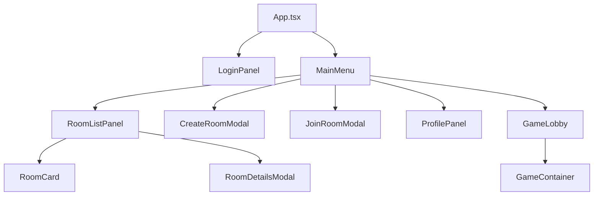
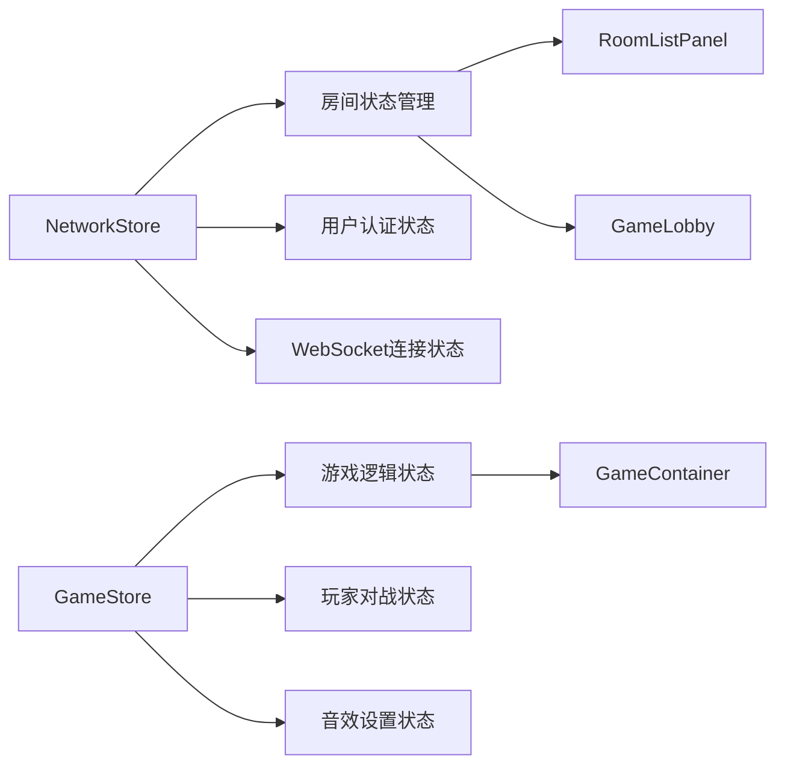
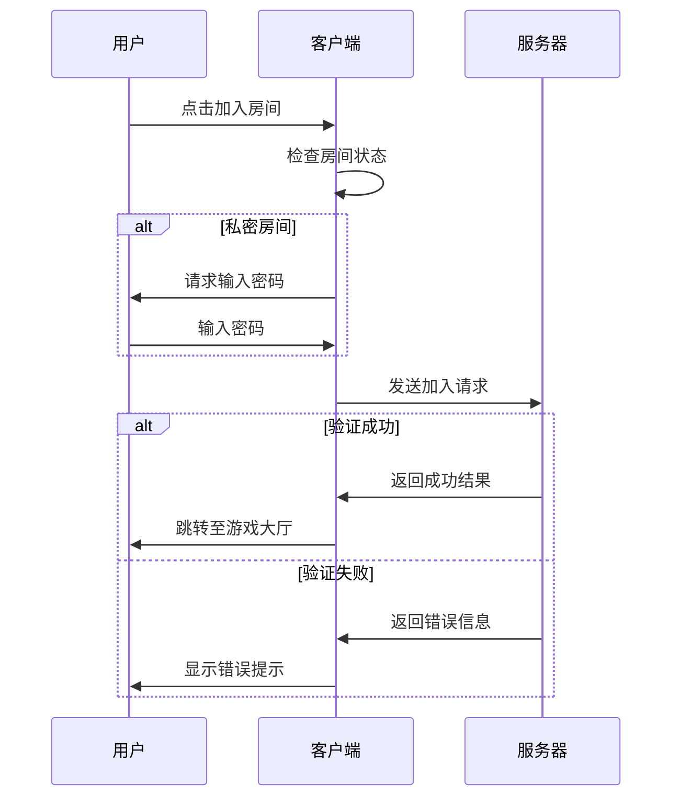
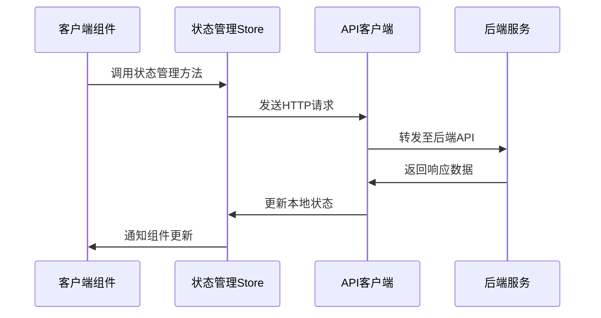
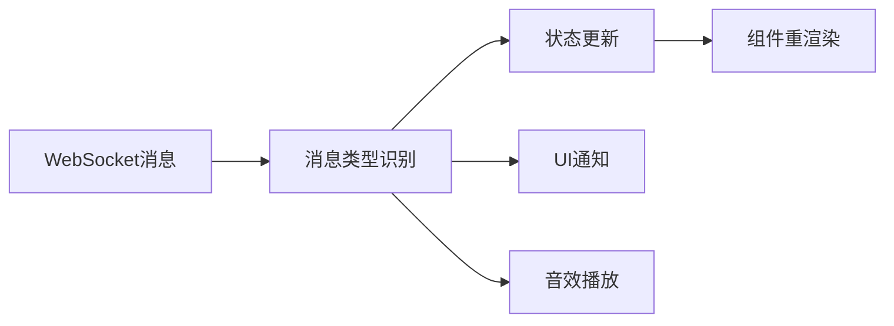

# 飞机大战游戏客户端UI优化设计文档

## 概述

本设计文档旨在优化飞机大战游戏的客户端界面，添加房间管理功能，使两名不同网络位置的玩家能够进行在线对战。当前服务端已实现房间创建、加入、获取等核心逻辑，但客户端缺少相应的用户界面和操作流程。

### 设计目标

- 为游戏添加完整的房间管理界面
- 实现多人在线匹配和游戏功能
- 提供直观的用户操作体验
- 确保网络连接的稳定性和游戏状态同步

## 技术栈与依赖

### 前端技术栈
- **React 18** - 主要UI框架
- **TypeScript** - 类型安全的JavaScript超集
- **Zustand** - 轻量级状态管理
- **Ant Design** - UI组件库
- **Vite** - 构建工具

### 网络通信
- **WebSocket** - 实时游戏状态同步
- **Fetch API** - HTTP请求处理
- **Socket.IO** (可选) - 增强的WebSocket功能

## 架构设计

### 组件架构层次



### 状态管理架构



## 核心功能设计

### 1. 主菜单界面

#### 功能描述
登录成功后的主要导航界面，提供房间管理和游戏设置功能。

#### 界面元素
| 组件 | 描述 | 交互行为 |
|------|------|----------|
| 房间列表按钮 | 查看所有可用房间 | 跳转至房间列表页面 |
| 创建房间按钮 | 创建新的游戏房间 | 打开创建房间对话框 |
| 快速匹配按钮 | 自动匹配其他玩家 | 加入第一个可用公开房间 |
| 个人资料按钮 | 查看和编辑用户信息 | 打开个人资料面板 |
| 设置按钮 | 音效和游戏设置 | 打开设置面板 |

#### 布局设计
- 采用卡片式布局，中央显示主要功能按钮
- 顶部显示用户头像和用户名
- 右上角显示在线状态指示器

### 2. 房间列表管理

#### 房间显示信息
| 字段 | 描述 | 显示格式 |
|------|------|----------|
| 房间名称 | 用户自定义房间名 | 文本标题 |
| 房间类型 | 公开/私密房间 | 图标标识 |
| 玩家数量 | 当前/最大玩家数 | "1/2" 格式 |
| 房间状态 | 等待/游戏中/已满 | 彩色状态标签 |
| 房主信息 | 房主用户名 | 文本显示 |
| 创建时间 | 房间创建时间戳 | 相对时间 |

#### 房间筛选功能
- **按状态筛选**: 等待中、游戏中、所有房间
- **按类型筛选**: 公开房间、私密房间
- **搜索功能**: 按房间名称或房主名称搜索
- **排序选项**: 按创建时间、玩家数量排序

#### 交互操作
- **加入房间**: 点击房间卡片直接加入
- **查看详情**: 右键或长按显示房间详细信息
- **刷新列表**: 下拉刷新或自动定时刷新

### 3. 房间创建流程

#### 房间配置参数
| 参数 | 类型 | 验证规则 | 默认值 |
|------|------|----------|--------|
| 房间名称 | 字符串 | 1-30字符，必填 | "新房间" |
| 房间类型 | 枚举 | 公开/私密 | 公开 |
| 房间密码 | 字符串 | 私密房间必填，4-8位 | 无 |
| 最大玩家数 | 数字 | 固定为2人 | 2 |

#### 创建流程步骤
1. **参数输入**: 用户填写房间基本信息
2. **参数验证**: 客户端实时验证输入有效性
3. **服务器请求**: 调用房间创建API
4. **创建确认**: 显示创建结果并跳转至房间大厅
5. **错误处理**: 显示具体错误信息并允许重试

### 4. 房间加入机制

#### 加入验证流程


#### 加入条件检查
- 房间未满员（当前玩家数 < 最大玩家数）
- 房间状态为"等待中"
- 私密房间密码正确
- 用户未在其他房间中

### 5. 游戏大厅设计

#### 大厅功能组件
| 组件名称 | 功能描述 | 显示内容 |
|----------|----------|----------|
| 房间信息面板 | 显示当前房间基本信息 | 房间名、创建时间、房主 |
| 玩家列表 | 展示房间内所有玩家 | 用户名、头像、准备状态 |
| 聊天区域 | 玩家间文字交流 | 消息历史、输入框 |
| 准备按钮 | 玩家准备状态切换 | 准备/取消准备 |
| 开始游戏按钮 | 房主启动游戏 | 仅房主可见，所有人准备后启用 |
| 离开房间按钮 | 退出当前房间 | 返回主菜单 |

#### 状态同步机制
- **玩家加入/离开**: 实时更新玩家列表
- **准备状态变更**: 同步显示所有玩家准备状态
- **聊天消息**: 即时广播给房间内所有玩家
- **游戏开始**: 同步跳转至游戏界面

### 6. 游戏状态同步

#### WebSocket消息类型
| 消息类型 | 触发时机 | 数据结构 |
|----------|----------|----------|
| PLAYER_JOINED | 玩家加入房间 | { playerId, username, avatarUrl } |
| PLAYER_LEFT | 玩家离开房间 | { playerId, reason } |
| PLAYER_READY | 玩家准备状态变更 | { playerId, isReady } |
| GAME_START | 游戏开始 | { gameId, players, startTime } |
| AIRPLANE_PLACED | 飞机放置完成 | { playerId, airplaneData } |
| ATTACK_ACTION | 玩家攻击 | { playerId, coordinate, result } |
| GAME_END | 游戏结束 | { winner, reason, statistics } |

#### 状态一致性保证
- **消息确认机制**: 关键操作需要服务器确认
- **状态重同步**: 连接恢复后重新获取游戏状态
- **冲突解决**: 服务器作为权威状态来源
- **超时处理**: 网络超时后的状态回滚

## 用户体验优化

### 1. 响应式界面设计

#### 屏幕适配策略
- **桌面端**: 1200px+ 宽度，三栏布局
- **平板端**: 768px-1200px，双栏布局
- **移动端**: <768px，单栏垂直布局
- **游戏区域**: 保持正方形比例，自适应缩放

#### 交互反馈机制
- **按钮点击**: 视觉反馈 + 音效反馈
- **加载状态**: 进度指示器 + 骨架屏
- **错误提示**: Toast通知 + 详细错误描述
- **成功操作**: 动画效果 + 确认音效

### 2. 网络状态指示

#### 连接状态显示
| 状态 | 视觉指示 | 用户提示 |
|------|----------|----------|
| 已连接 | 绿色圆点 | "在线" |
| 连接中 | 黄色闪烁 | "连接中..." |
| 连接失败 | 红色圆点 | "连接失败" |
| 重连中 | 橙色旋转 | "重新连接..." |

#### 网络异常处理
- **自动重连**: 连接断开后自动尝试重连
- **操作缓存**: 网络恢复后重新执行失败操作
- **降级体验**: 网络不稳定时禁用部分功能
- **用户通知**: 明确告知网络状态变化

### 3. 音效与视觉效果

#### 音效分类设计
| 事件类型 | 音效文件 | 播放时机 |
|----------|----------|----------|
| 房间操作 | room_join.mp3 | 加入房间成功 |
| 游戏准备 | ready_confirm.mp3 | 玩家确认准备 |
| 游戏开始 | game_start.mp3 | 所有玩家准备完毕 |
| 攻击动作 | attack_launch.mp3 | 发起攻击 |
| 命中效果 | hit_target.mp3 | 攻击命中 |
| 胜利庆祝 | victory_fanfare.mp3 | 游戏获胜 |

#### 动画效果设计
- **页面切换**: 滑动过渡动画
- **房间列表**: 卡片浮现动画
- **玩家状态**: 图标变化动画
- **游戏操作**: 点击波纹效果

## 技术实现架构

### 1. 状态管理架构

#### NetworkStore扩展
新增房间管理相关状态和方法：

| 状态字段 | 类型 | 描述 |
|----------|------|------|
| roomList | RoomListItem[] | 房间列表数据 |
| currentRoom | RoomDetails &#124; null | 当前所在房间 |
| isInLobby | boolean | 是否在游戏大厅 |
| lobbyPlayers | PlayerInfo[] | 大厅内玩家列表 |

| 方法名称 | 参数 | 返回值 | 功能描述 |
|----------|------|--------|----------|
| loadRoomList | (filters?) | Promise\<void> | 获取房间列表 |
| createRoom | (roomData) | Promise\<boolean> | 创建房间 |
| joinRoom | (roomId, password?) | Promise\<boolean> | 加入房间 |
| leaveRoom | () | Promise\<void> | 离开房间 |
| updatePlayerReady | (isReady) | void | 更新准备状态 |

### 2. 组件设计规范

#### 组件命名约定
- **页面组件**: 以"Page"结尾，如`RoomListPage`
- **功能组件**: 以功能名称命名，如`RoomCard`
- **弹窗组件**: 以"Modal"结尾，如`CreateRoomModal`
- **面板组件**: 以"Panel"结尾，如`PlayerListPanel`

#### Props接口设计
```typescript
// 房间卡片组件接口
interface RoomCardProps {
  room: RoomListItem
  onJoin: (roomId: string) => void
  onViewDetails: (roomId: string) => void
  disabled?: boolean
}

// 游戏大厅组件接口
interface GameLobbyProps {
  room: RoomDetails
  currentUser: UserProfile
  onPlayerReady: (isReady: boolean) => void
  onLeaveRoom: () => void
  onStartGame: () => void
}
```

### 3. API集成设计

#### HTTP API调用流程


#### 错误处理策略
- **网络错误**: 自动重试机制
- **认证错误**: 自动跳转登录页面
- **业务错误**: 显示具体错误信息
- **服务器错误**: 显示通用错误提示

### 4. WebSocket集成架构

#### 消息处理机制


#### 连接管理策略
- **心跳检测**: 定期发送ping消息保持连接
- **重连机制**: 指数退避算法重连
- **消息队列**: 断线期间缓存待发送消息
- **状态同步**: 重连后同步最新状态

## 测试策略

### 1. 单元测试覆盖

#### 测试目标组件
| 组件类型 | 测试重点 | 工具选择 |
|----------|----------|----------|
| 状态管理 | 状态变更逻辑 | Jest + React Testing Library |
| UI组件 | 渲染和交互 | Jest + Testing Library |
| API客户端 | 请求响应处理 | Jest + MSW |
| WebSocket | 消息收发 | Jest + WS Mock |

#### 核心测试用例
- 房间创建和加入流程
- 玩家准备状态同步
- 网络断线重连机制
- 游戏状态转换逻辑

### 2. 集成测试设计

#### 端到端测试场景
1. **完整游戏流程**: 从登录到游戏结束
2. **多人协作场景**: 模拟两个玩家同时操作
3. **网络异常测试**: 模拟网络中断和恢复
4. **并发操作测试**: 同时进行多种操作

#### 性能测试指标
- 页面加载时间 < 2秒
- WebSocket消息延迟 < 100ms
- 内存使用稳定增长 < 10MB/小时
- CPU使用率峰值 < 20%

## 部署与运维考虑

### 1. 构建优化策略

#### 代码分割方案
- **路由分割**: 按页面组件分割
- **组件懒加载**: 大型组件按需加载
- **第三方库分离**: 独立打包稳定依赖
- **资源压缩**: 图片和音频文件优化

#### 缓存策略设计
- **静态资源**: 长期缓存（1年）
- **API响应**: 短期缓存（5分钟）
- **WebSocket重连**: 本地状态缓存
- **用户设置**: localStorage持久化

### 2. 监控与日志

#### 关键指标监控
| 指标类型 | 监控内容 | 告警阈值 |
|----------|----------|----------|
| 性能指标 | 页面加载时间 | >3秒 |
| 错误率 | JS错误发生率 | >1% |
| 网络状态 | WebSocket连接成功率 | <95% |
| 用户行为 | 房间创建成功率 | <90% |

#### 日志记录策略
- **用户操作日志**: 记录关键用户行为
- **网络请求日志**: 记录API调用和响应
- **错误日志**: 详细记录错误堆栈信息
- **性能日志**: 记录关键性能指标