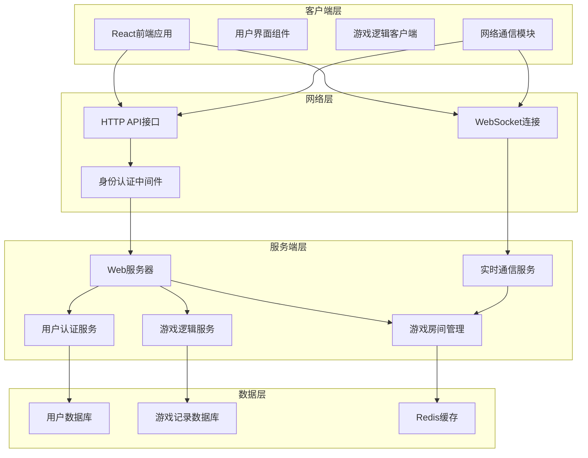
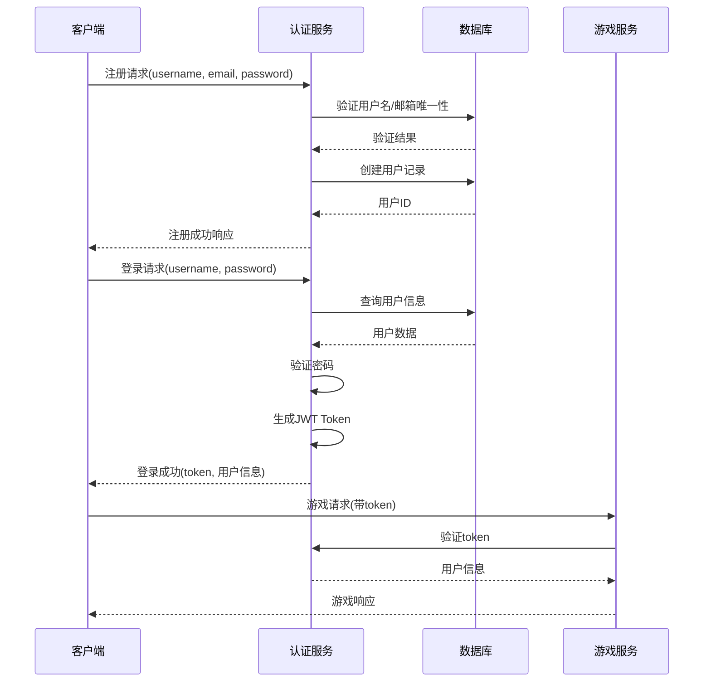
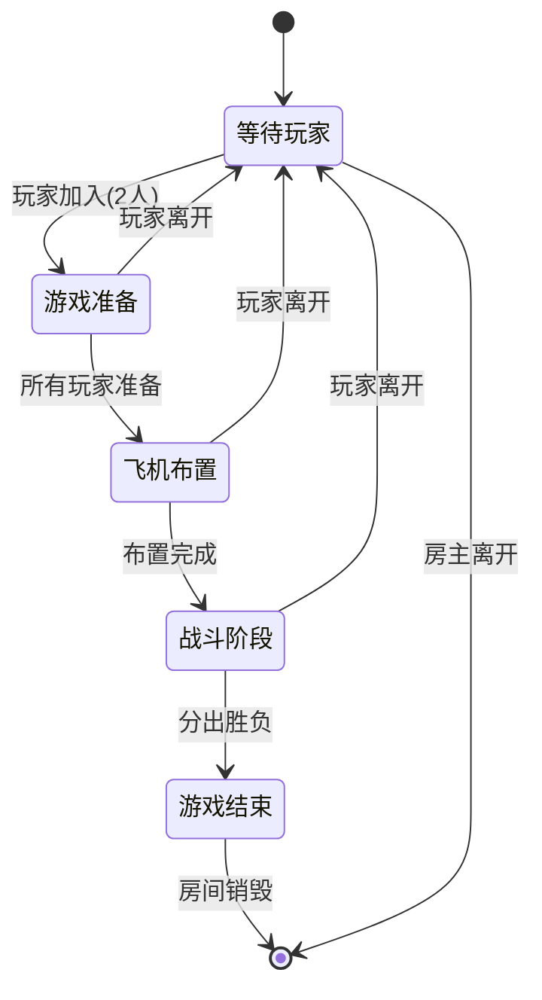

# 飞机大战网络化增强设计文档

## 概述

本设计文档详细描述了为现有飞机大战游戏添加登录系统和服务端支持的技术方案。通过引入用户认证、网络通信和服务端架构，将单机游戏升级为支持实时多人对战的网络游戏。

### 核心目标
- 实现用户注册登录系统，支持玩家身份管理
- 构建服务端架构，处理游戏逻辑和数据持久化
- 建立实时通信机制，支持网络对战
- 保证游戏数据的一致性和安全性
- 支持多种网络环境下的稳定连接

### 技术价值
- 从单机游戏扩展为多人在线游戏
- 提供完整的用户体系和数据管理
- 实现实时游戏状态同步
- 建立可扩展的游戏服务架构

## 系统架构

### 整体架构图



### 技术栈规划

| 层级 | 技术选型 | 说明 |
|------|---------|------|
| 前端 | React 19 + TypeScript + Zustand | 继承现有技术栈 |
| 网络通信 | WebSocket + Fetch API | 实时通信和HTTP请求 |
| 后端框架 | Node.js + Express + Socket.IO | 高性能JavaScript服务端 |
| 数据库 | PostgreSQL + Redis | 关系数据库存储 + 内存缓存 |
| 身份认证 | JWT + bcrypt | 无状态认证和密码加密 |
| 部署 | Docker + Nginx | 容器化部署和负载均衡 |

## 用户认证系统设计

### 用户数据模型

| 字段名 | 类型 | 说明 | 约束 |
|--------|------|------|------|
| user_id | UUID | 用户唯一标识 | 主键 |
| username | VARCHAR(50) | 用户名 | 唯一，不为空 |
| email | VARCHAR(100) | 邮箱地址 | 唯一，不为空 |
| password_hash | VARCHAR(255) | 加密密码 | 不为空 |
| display_name | VARCHAR(100) | 显示名称 | 可为空 |
| avatar_url | VARCHAR(500) | 头像链接 | 可为空 |
| level | INTEGER | 玩家等级 | 默认1 |
| experience | BIGINT | 经验值 | 默认0 |
| wins | INTEGER | 胜利次数 | 默认0 |
| losses | INTEGER | 失败次数 | 默认0 |
| rating | INTEGER | 等级分 | 默认1000 |
| created_at | TIMESTAMP | 注册时间 | 自动生成 |
| last_login | TIMESTAMP | 最后登录 | 可为空 |
| is_active | BOOLEAN | 账户状态 | 默认true |

### 认证流程设计



### 身份验证接口规范

#### 用户注册接口
- **路径**: `POST /api/auth/register`
- **请求体**:
  ```
  {
    "username": "玩家用户名",
    "email": "邮箱地址", 
    "password": "明文密码",
    "displayName": "显示名称"
  }
  ```
- **响应体**:
  ```
  {
    "success": true,
    "message": "注册成功",
    "data": {
      "userId": "用户ID",
      "username": "用户名"
    }
  }
  ```

#### 用户登录接口
- **路径**: `POST /api/auth/login`
- **请求体**:
  ```
  {
    "username": "用户名",
    "password": "密码"
  }
  ```
- **响应体**:
  ```
  {
    "success": true,
    "message": "登录成功",
    "data": {
      "token": "JWT令牌",
      "user": {
        "userId": "用户ID",
        "username": "用户名",
        "displayName": "显示名称",
        "level": 等级,
        "rating": 等级分
      }
    }
  }
  ```

## 服务端架构设计

### 核心服务模块

#### 用户管理服务
- **功能职责**: 处理用户注册、登录、信息更新
- **核心接口**:
  - 用户注册验证
  - 密码加密存储
  - 登录状态管理
  - 用户信息查询更新

#### 房间管理服务
- **功能职责**: 管理游戏房间的创建、加入、退出
- **核心功能**:
  - 房间生命周期管理
  - 玩家匹配算法
  - 房间状态同步
  - 观战者支持

#### 游戏逻辑服务
- **功能职责**: 处理游戏核心逻辑和状态管理
- **核心功能**:
  - 游戏状态验证
  - 回合制逻辑控制
  - 胜负判定
  - 作弊检测

#### 实时通信服务
- **功能职责**: 处理WebSocket连接和消息分发
- **核心功能**:
  - 连接状态管理
  - 消息路由分发
  - 断线重连处理
  - 心跳检测

### 房间系统设计

#### 房间数据模型

| 字段名 | 类型 | 说明 |
|--------|------|------|
| room_id | UUID | 房间唯一标识 |
| room_name | VARCHAR(100) | 房间名称 |
| room_type | ENUM | 房间类型(public/private) |
| password | VARCHAR(50) | 房间密码(私人房间) |
| max_players | INTEGER | 最大玩家数(固定为2) |
| current_players | INTEGER | 当前玩家数 |
| game_mode | ENUM | 游戏模式(pvp/tournament) |
| status | ENUM | 房间状态(waiting/playing/finished) |
| host_user_id | UUID | 房主用户ID |
| created_at | TIMESTAMP | 创建时间 |

#### 房间管理流程



### 数据持久化设计

#### 游戏记录数据模型

| 字段名 | 类型 | 说明 |
|--------|------|------|
| game_id | UUID | 游戏记录ID |
| room_id | UUID | 关联房间ID |
| player1_id | UUID | 玩家1用户ID |
| player2_id | UUID | 玩家2用户ID |
| winner_id | UUID | 获胜者用户ID |
| game_duration | INTEGER | 游戏时长(秒) |
| total_turns | INTEGER | 总回合数 |
| player1_airplane | JSON | 玩家1飞机位置 |
| player2_airplane | JSON | 玩家2飞机位置 |
| attack_history | JSON | 攻击历史记录 |
| started_at | TIMESTAMP | 游戏开始时间 |
| finished_at | TIMESTAMP | 游戏结束时间 |

#### Redis缓存策略

| 缓存类型 | Key格式 | 数据内容 | 过期时间 |
|----------|---------|----------|----------|
| 用户会话 | `session:{user_id}` | 用户登录状态 | 24小时 |
| 房间信息 | `room:{room_id}` | 房间完整状态 | 1小时 |
| 游戏状态 | `game:{room_id}` | 实时游戏数据 | 30分钟 |
| 在线用户 | `online:users` | 在线用户列表 | 实时更新 |

## 网络通信协议设计

### WebSocket消息格式

#### 标准消息结构
```
{
  "type": "消息类型",
  "payload": "消息数据",
  "timestamp": "时间戳",
  "messageId": "消息ID"
}
```

#### 核心消息类型定义

| 消息类型 | 方向 | 描述 | 数据结构 |
|----------|------|------|----------|
| JOIN_ROOM | C→S | 加入房间 | `{roomId: string}` |
| ROOM_JOINED | S→C | 房间加入成功 | `{room: RoomInfo, players: Player[]}` |
| PLAYER_JOINED | S→C | 新玩家加入 | `{player: Player}` |
| PLAYER_LEFT | S→C | 玩家离开 | `{playerId: string}` |
| GAME_START | S→C | 游戏开始 | `{gameState: GameState}` |
| PLACE_AIRPLANE | C→S | 放置飞机 | `{position: AirplanePosition}` |
| AIRPLANE_PLACED | S→C | 飞机放置完成 | `{playerId: string, success: boolean}` |
| ATTACK | C→S | 发起攻击 | `{coordinate: Coordinate}` |
| ATTACK_RESULT | S→C | 攻击结果 | `{result: AttackResult, gameState: GameState}` |
| GAME_END | S→C | 游戏结束 | `{winner: string, gameStats: GameStats}` |

### 实时同步策略

#### 游戏状态同步机制
- **乐观更新**: 客户端立即显示操作结果，等待服务端确认
- **状态校验**: 服务端定期发送状态摘要进行一致性检查
- **冲突解决**: 以服务端状态为准，回滚客户端不一致操作
- **断线重连**: 支持无缝重连和状态恢复

#### 网络优化策略
- **消息压缩**: 对大型游戏状态消息进行压缩传输
- **增量更新**: 只传输变化的游戏状态数据
- **消息队列**: 缓存离线期间的重要消息
- **心跳检测**: 定期检测连接状态，及时处理断线

## 前端集成方案

### 网络客户端架构

#### 网络通信模块设计
```
NetworkManager
├── AuthClient          // 认证客户端
├── WebSocketClient     // WebSocket客户端  
├── HttpClient          // HTTP客户端
├── GameClient          // 游戏逻辑客户端
└── ConnectionManager   // 连接管理器
```

#### 状态管理扩展

现有Zustand状态需要扩展以下模块：

| 状态模块 | 职责范围 |
|----------|----------|
| AuthStore | 用户认证状态管理 |
| NetworkStore | 网络连接状态管理 |
| RoomStore | 房间信息状态管理 |
| MultiplayerGameStore | 多人游戏状态管理 |

#### 用户界面扩展

需要新增的核心界面组件：

| 组件名称 | 功能描述 |
|----------|----------|
| LoginPanel | 用户登录界面 |
| RegisterPanel | 用户注册界面 |
| UserProfile | 用户信息展示 |
| RoomList | 房间列表界面 |
| RoomLobby | 房间大厅界面 |
| PlayerMatchmaking | 玩家匹配界面 |
| NetworkStatus | 网络状态指示器 |

### 离线模式兼容

为保证现有功能可用性，需要设计离线模式兼容机制：

#### 游戏模式切换
- **在线模式**: 连接服务器进行网络对战
- **离线模式**: 保持现有单机游戏功能
- **混合模式**: 支持在线匹配和本地AI对战

#### 数据同步策略
- **本地存储**: 离线模式下的游戏记录保存到本地
- **数据上传**: 网络恢复后同步本地记录到服务器
- **冲突处理**: 处理本地和服务器数据的冲突情况

## 安全性设计

### 身份认证安全

#### 密码安全策略
- **加密算法**: 使用bcrypt进行密码哈希
- **盐值处理**: 为每个密码生成唯一盐值
- **强度要求**: 密码长度和复杂度验证
- **失败限制**: 登录失败次数限制和锁定机制

#### JWT令牌管理
- **签名算法**: 使用RS256非对称加密算法
- **有效期限**: 访问令牌1小时，刷新令牌7天
- **令牌刷新**: 自动刷新机制避免频繁登录
- **令牌撤销**: 支持令牌黑名单和主动撤销

### 游戏安全防护

#### 作弊检测机制
- **操作验证**: 服务端验证所有游戏操作的合法性
- **时间检测**: 检测异常的操作时间间隔
- **状态校验**: 定期校验客户端和服务端状态一致性
- **行为分析**: 分析玩家行为模式识别异常

#### 数据传输安全
- **HTTPS加密**: API接口使用HTTPS加密传输
- **WSS连接**: WebSocket连接使用WSS加密
- **数据校验**: 关键数据添加校验和防篡改
- **访问控制**: 基于角色的访问权限控制

## 性能优化策略

### 服务端性能优化

#### 连接池管理
- **数据库连接池**: 优化数据库连接复用
- **Redis连接池**: 缓存连接的高效管理
- **WebSocket连接**: 连接数限制和资源清理

#### 缓存策略
- **多级缓存**: 内存缓存、Redis缓存、数据库存储
- **缓存预热**: 常用数据的预加载机制
- **缓存更新**: 数据变更时的缓存同步策略
- **缓存穿透**: 防止恶意请求绕过缓存

### 客户端性能优化

#### 渲染优化
- **虚拟化**: 大列表的虚拟滚动实现
- **懒加载**: 组件和资源的按需加载
- **防抖节流**: 用户操作的频率控制
- **内存管理**: 及时清理不用的事件监听器

#### 网络优化
- **请求合并**: 批量处理多个API请求
- **离线缓存**: 关键资源的本地缓存
- **预加载**: 预测性的资源预加载
- **压缩传输**: 响应数据的压缩处理

## 部署架构

### 容器化部署方案

#### 服务容器规划
```
应用架构
├── nginx-proxy        // 反向代理服务
├── web-server         // Node.js Web服务
├── postgres-db        // PostgreSQL数据库
├── redis-cache        // Redis缓存服务
└── file-storage       // 静态文件存储
```

#### 环境配置管理

| 环境 | 用途 | 配置特点 |
|------|------|----------|
| 开发环境 | 本地开发测试 | 热重载，详细日志 |
| 测试环境 | 集成测试验证 | 模拟数据，自动化测试 |
| 预发环境 | 生产前验证 | 生产数据副本 |
| 生产环境 | 正式服务 | 高可用，监控告警 |

### 监控和运维

#### 系统监控指标
- **服务器指标**: CPU、内存、磁盘、网络使用率
- **应用指标**: 响应时间、吞吐量、错误率
- **业务指标**: 在线用户数、游戏场次、用户活跃度
- **数据库指标**: 连接数、查询性能、慢查询

#### 日志管理策略
- **分级日志**: ERROR、WARN、INFO、DEBUG四个级别
- **结构化日志**: JSON格式便于解析和查询
- **日志收集**: 集中收集所有服务的日志
- **日志分析**: 实时分析和历史趋势分析

## 测试策略

### 单元测试设计

#### 前端单元测试
- **组件测试**: React组件的渲染和交互测试
- **状态管理测试**: Zustand store的状态变更测试
- **工具函数测试**: 游戏逻辑和工具函数测试
- **网络模块测试**: 网络请求和WebSocket通信测试

#### 后端单元测试
- **API接口测试**: 所有HTTP接口的功能测试
- **服务逻辑测试**: 业务逻辑和数据处理测试
- **数据库测试**: 数据模型和查询操作测试
- **WebSocket测试**: 实时通信功能测试

### 集成测试设计

#### 端到端测试场景
- **用户注册登录流程**: 完整的用户认证流程测试
- **房间创建加入流程**: 多用户房间交互测试
- **完整游戏流程**: 从开始到结束的游戏流程测试
- **网络异常处理**: 断线重连和错误恢复测试

#### 压力测试规划
- **并发用户测试**: 模拟大量用户同时在线
- **高频操作测试**: 密集的游戏操作压力测试
- **长时间运行测试**: 服务稳定性和内存泄漏测试
- **峰值流量测试**: 模拟用户访问高峰情况