# 游戏房间逻辑优化设计方案

## 概述

本设计方案旨在优化飞行射击游戏的房间管理系统，实现更合理的房间创建、管理和玩家状态同步机制。重点解决房主权限管理、房间生命周期控制、玩家重连机制以及数据类型优化等关键问题。

## 技术栈与依赖

- **前端**: React + TypeScript + Zustand状态管理
- **后端**: Node.js + Express + TypeScript + MongoDB + Redis
- **实时通信**: Socket.IO
- **数据库**: MongoDB (房间持久化) + Redis (缓存和会话)

## 核心优化需求

1. **房间创建限制**: 每个玩家只允许创建一个未开始的房间
2. **房主权限管理**: 房主自动加入房间，退出时解散房间并踢出其他玩家
3. **房间信息增强**: 房间列表显示所有玩家信息和准备状态
4. **重连机制**: 玩家重连后自动回到之前的房间
5. **数据类型优化**: userId改为int64类型，roomId采用userId+时间戳格式

## 架构设计

### 数据模型重构

#### 用户模型优化

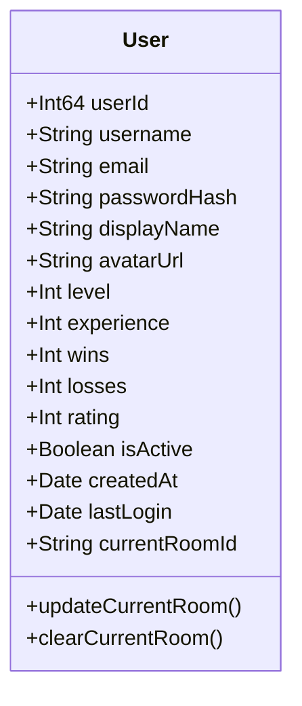

**关键变更**:
- userId字段从String改为Int64类型，提供更好的性能和唯一性
- 新增currentRoomId字段，用于追踪用户当前所在房间，支持重连机制

#### 房间模型优化

```mermaid
classDiagram
    class Room {
        +String roomId
        +String roomName
        +RoomType roomType
        +String password
        +Int maxPlayers
        +Int currentPlayers
        +RoomStatus status
        +Int64 hostUserId
        +RoomMember[] members
        +Date createdAt
        +Date updatedAt
        +Boolean isHostCreated
        +addMember(userId: Int64)
        +removeMember(userId: Int64)
        +dissolveRoom()
        +transferHost(newHostId: Int64)
    }

    class RoomMember {
        +Int64 userId
        +String username
        +String displayName
        +Int playerNumber
        +Boolean isReady
        +Boolean isConnected
        +Date joinedAt
        +PlayerGameState gameState
    }

    Room ||--o{ RoomMember : contains
```

**关键变更**:
- roomId格式改为`{userId}_{timestamp}`，确保唯一性且包含创建者信息
- hostUserId字段改为Int64类型
- 新增isHostCreated标记，区分房主创建的房间
- members数组增强，包含完整的玩家状态信息
- 新增房间解散和房主转移功能

#### RoomId生成策略

| 组成部分 | 格式 | 示例 | 说明 |
|---------|------|------|------|
| 用户ID | Int64 | 1001 | 房主的唯一标识 |
| 时间戳 | Unix毫秒 | 1703123456789 | 创建时间，确保唯一性 |
| 分隔符 | 下划线 | _ | 连接符 |
| 完整RoomId | String | 1001_1703123456789 | 最终房间标识 |

### 房间生命周期管理

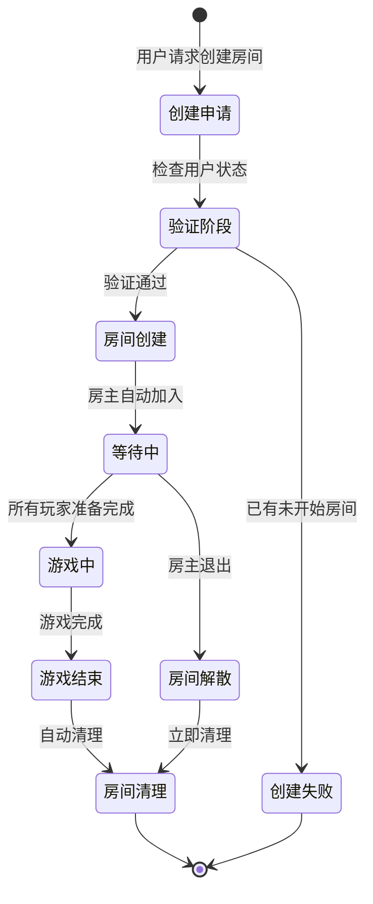

### 玩家状态同步机制

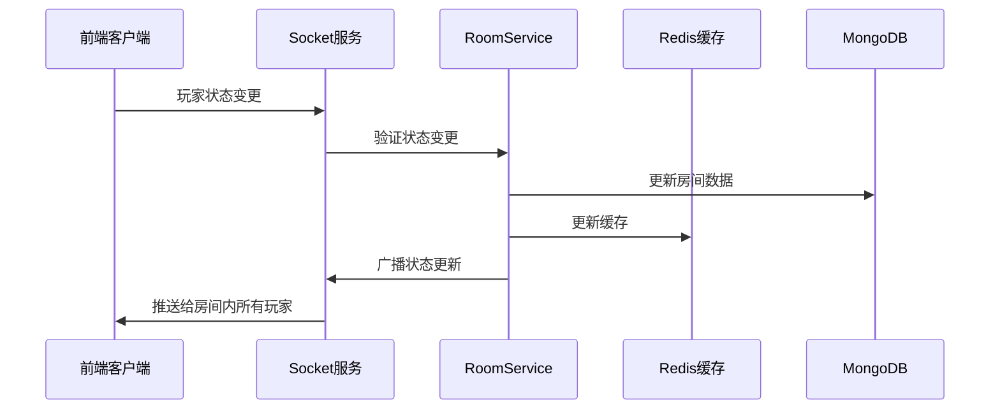

## 核心功能实现设计

### 房间创建限制机制

#### 创建前检查流程

| 检查步骤 | 验证内容 | 失败处理 |
|---------|---------|---------|
| 用户验证 | 用户是否存在且活跃 | 返回用户不存在错误 |
| 房间数量检查 | 用户是否已有未开始房间 | 返回房间数量限制错误 |
| 资源检查 | 系统资源是否充足 | 返回系统繁忙错误 |
| 权限验证 | 用户是否有创建权限 | 返回权限不足错误 |

#### 房间创建策略

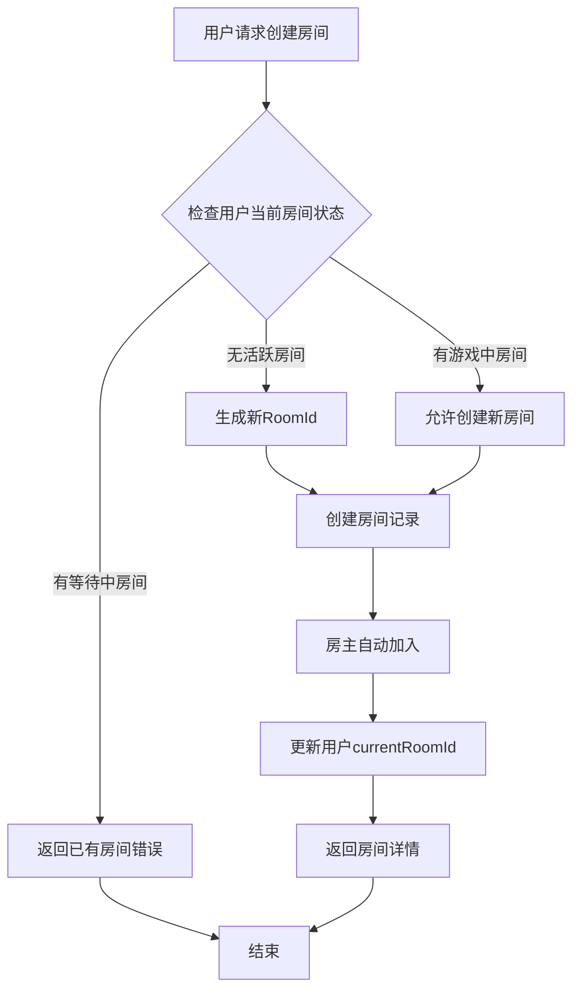

### 房主权限管理系统

#### 房主特权表

| 权限类型 | 功能描述 | 实现方式 |
|---------|---------|---------|
| 房间解散 | 可以解散整个房间 | 检查hostUserId匹配 |
| 踢出玩家 | 移除房间内其他玩家 | 验证房主身份后执行 |
| 游戏开始 | 控制游戏开始时机 | 仅房主可触发开始 |
| 房间设置 | 修改房间名称、密码等 | 房主专有权限 |
| 房主转移 | 将房主权限转给其他玩家 | 主动转移或自动转移 |

#### 房主转移机制

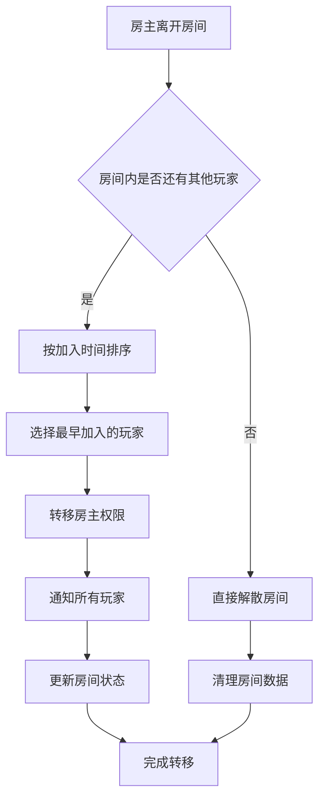

### 房间列表信息增强

#### 房间列表数据结构

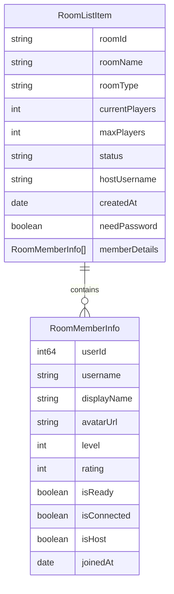

#### 房间列表查询优化

| 查询场景 | 索引策略 | 性能优化 |
|---------|---------|---------|
| 按状态筛选 | status + createdAt 复合索引 | 支持分页查询 |
| 按房间类型筛选 | roomType + status 复合索引 | 快速过滤公开/私有房间 |
| 按创建时间排序 | createdAt 降序索引 | 最新房间优先显示 |
| 用户房间查询 | members.userId 索引 | 快速找到用户所在房间 |

### 玩家重连机制

#### 重连检测流程

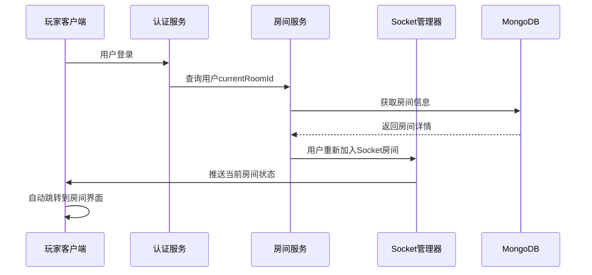

#### 重连状态处理

| 用户状态 | 房间状态 | 处理策略 |
|---------|---------|---------|
| 有currentRoomId | 房间存在且等待中 | 自动重连到房间 |
| 有currentRoomId | 房间存在且游戏中 | 重连到游戏状态 |
| 有currentRoomId | 房间已解散 | 清除currentRoomId |
| 无currentRoomId | - | 正常进入主菜单 |

### 数据类型优化实现

#### UserId类型转换策略

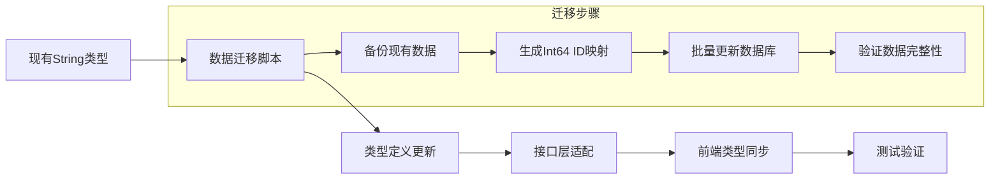

#### 兼容性处理方案

| 阶段 | String UserId | Int64 UserId | 处理方式 |
|------|---------------|--------------|----------|
| 迁移前 | ✓ | ✗ | 仅支持String |
| 迁移中 | ✓ | ✓ | 双格式兼容 |
| 迁移后 | ✗ | ✓ | 仅支持Int64 |

## API接口设计

### 房间管理接口

#### 创建房间接口

| 字段 | 类型 | 必填 | 说明 |
|------|------|------|------|
| roomName | String | 是 | 房间名称，1-100字符 |
| roomType | Enum | 是 | public/private |
| password | String | 否 | 私有房间密码 |

**响应数据结构**:
```
{
  success: boolean,
  message: string,
  data: {
    roomId: string,
    roomDetails: RoomDetails
  }
}
```

#### 房间列表接口

**查询参数**:
| 参数 | 类型 | 默认值 | 说明 |
|------|------|--------|------|
| page | Number | 1 | 页码 |
| limit | Number | 10 | 每页数量 |
| roomType | String | all | 房间类型筛选 |
| includeMembers | Boolean | true | 是否包含成员详情 |

#### 重连检测接口

**接口路径**: GET /api/rooms/reconnect
**响应数据**:
```
{
  success: boolean,
  data: {
    hasActiveRoom: boolean,
    roomDetails?: RoomDetails
  }
}
```

### Socket事件定义

#### 房间相关事件

| 事件名称 | 方向 | 数据结构 | 说明 |
|---------|------|---------|------|
| room:created | 服务端→客户端 | RoomDetails | 房间创建成功 |
| room:dissolved | 服务端→客户端 | {roomId, reason} | 房间被解散 |
| player:joined | 服务端→客户端 | PlayerInfo | 玩家加入房间 |
| player:left | 服务端→客户端 | {userId, reason} | 玩家离开房间 |
| player:ready | 客户端→服务端 | {isReady} | 玩家准备状态 |
| player:kicked | 服务端→客户端 | {userId, reason} | 玩家被踢出 |
| host:transferred | 服务端→客户端 | {newHostId, oldHostId} | 房主转移 |

## 前端状态管理优化

### NetworkStore增强

#### 房间状态管理

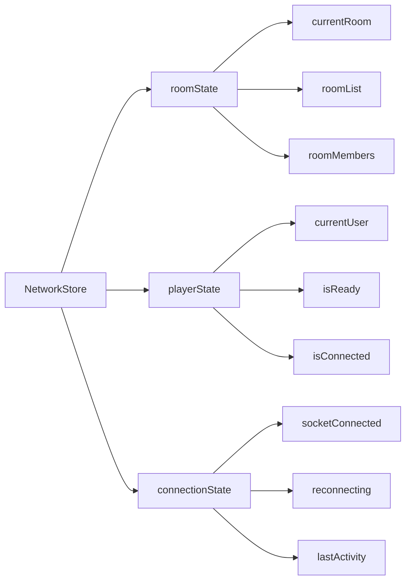

#### 状态同步机制

| 状态类型 | 更新触发 | 同步方式 | 持久化 |
|---------|---------|---------|---------|
| 房间基本信息 | Socket推送 | 实时更新 | 否 |
| 玩家列表 | 成员变更 | 增量更新 | 否 |
| 用户准备状态 | 用户操作 | 立即同步 | 是 |
| 连接状态 | 网络事件 | 自动检测 | 否 |

### 重连逻辑实现

#### 自动重连流程

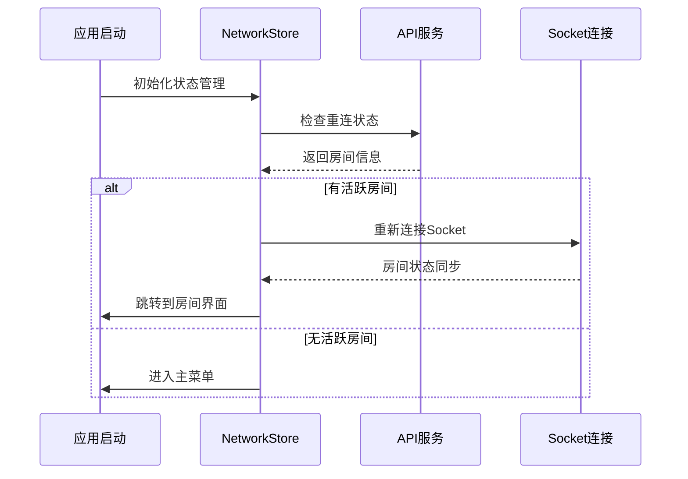

## 数据库设计优化

### MongoDB集合结构

#### 用户集合优化

| 字段名 | 原类型 | 新类型 | 索引 | 说明 |
|--------|--------|--------|------|------|
| userId | String | Int64 | 主键 | 用户唯一标识 |
| username | String | String | 唯一索引 | 用户名 |
| currentRoomId | - | String | 普通索引 | 当前房间ID |
| lastActivity | - | Date | 普通索引 | 最后活跃时间 |

#### 房间集合优化

| 字段名 | 类型 | 索引 | 说明 |
|--------|------|------|------|
| roomId | String | 主键 | {userId}_{timestamp}格式 |
| hostUserId | Int64 | 普通索引 | 房主用户ID |
| status | String | 复合索引(status+createdAt) | 房间状态 |
| members.userId | Int64 | 多值索引 | 成员用户ID |

### Redis缓存策略

#### 缓存数据类型

| 数据类型 | Redis键格式 | TTL | 用途 |
|---------|-------------|-----|------|
| 房间详情 | room:{roomId} | 1小时 | 快速访问房间信息 |
| 用户会话 | user:session:{userId} | 24小时 | 用户登录状态 |
| 房间成员 | room:members:{roomId} | 1小时 | 成员列表缓存 |
| 在线用户 | online:users | 实时 | 在线用户统计 |

## 测试策略

### 功能测试用例

#### 房间创建测试

| 测试场景 | 输入条件 | 期望结果 |
|---------|---------|---------|
| 正常创建房间 | 有效用户，无现有房间 | 创建成功，房主自动加入 |
| 重复创建房间 | 用户已有等待中房间 | 创建失败，返回限制错误 |
| 游戏中创建房间 | 用户在游戏中房间 | 允许创建新房间 |
| 无效用户创建 | 不存在的用户ID | 创建失败，用户验证错误 |

#### 房主权限测试

| 测试场景 | 操作用户 | 期望结果 |
|---------|---------|---------|
| 房主解散房间 | 房主用户 | 房间解散，其他玩家被踢出 |
| 非房主解散房间 | 普通成员 | 操作失败，权限不足 |
| 房主离开房间 | 房主用户 | 房间解散或转移房主 |
| 房主踢出玩家 | 房主用户 | 目标玩家被移除 |

#### 重连测试

| 测试场景 | 用户状态 | 期望结果 |
|---------|---------|---------|
| 正常重连 | 有活跃房间 | 自动回到房间 |
| 房间已解散重连 | 房间不存在 | 清除状态，进入主菜单 |
| 网络断线重连 | 临时断网 | 自动重连，状态恢复 |

### 性能测试指标

| 测试项目 | 性能指标 | 测试方法 |
|---------|---------|---------|
| 房间创建响应时间 | < 200ms | 压力测试 |
| 房间列表查询时间 | < 100ms | 并发查询 |
| Socket消息延迟 | < 50ms | 网络测试 |
| 数据库查询优化 | < 10ms | 索引验证 |

## 部署与监控

### 数据迁移计划

#### 迁移步骤

1. **预备阶段**
   - 备份现有数据库
   - 验证迁移脚本
   - 准备回滚方案

2. **迁移阶段**
   - 执行userId类型转换
   - 更新现有房间数据
   - 重建相关索引

3. **验证阶段**
   - 功能回归测试
   - 性能基准测试
   - 数据完整性检查

4. **上线阶段**
   - 灰度发布
   - 监控告警配置
   - 用户通知

### 监控指标

#### 业务监控

| 监控项目 | 阈值 | 告警级别 | 处理方式 |
|---------|------|---------|----------|
| 房间创建成功率 | > 95% | 警告 | 检查系统资源 |
| 玩家重连成功率 | > 90% | 警告 | 检查网络状态 |
| Socket连接稳定性 | > 99% | 严重 | 立即处理 |
| 数据库响应时间 | < 100ms | 警告 | 优化查询 |

#### 技术监控

| 系统指标 | 正常范围 | 监控频率 | 告警策略 |
|---------|---------|---------|----------|
| CPU使用率 | < 80% | 1分钟 | 超过90%告警 |
| 内存使用率 | < 85% | 1分钟 | 超过95%告警 |
| Redis命中率 | > 90% | 5分钟 | 低于80%告警 |
| MongoDB连接数 | < 80% | 1分钟 | 超过90%告警 |

## 风险评估与应对

### 技术风险

#### 数据迁移风险

| 风险类型 | 影响程度 | 发生概率 | 应对策略 |
|---------|---------|---------|----------|
| 数据丢失 | 高 | 低 | 多重备份，分步迁移 |
| 迁移时间过长 | 中 | 中 | 预演测试，优化脚本 |
| 类型转换错误 | 高 | 低 | 严格测试，回滚方案 |
| 索引重建失败 | 中 | 低 | 备用索引策略 |

#### 性能风险

| 风险类型 | 影响程度 | 发生概率 | 应对策略 |
|---------|---------|---------|----------|
| 房间查询性能下降 | 中 | 中 | 索引优化，缓存策略 |
| Socket连接数过多 | 高 | 中 | 连接池管理，负载均衡 |
| 内存泄漏 | 高 | 低 | 监控告警，定期重启 |
| 数据库压力过大 | 高 | 中 | 读写分离，查询优化 |

### 业务风险

#### 用户体验风险

| 风险类型 | 影响程度 | 发生概率 | 应对策略 |
|---------|---------|---------|----------|
| 房间创建限制过严 | 中 | 中 | 合理的限制策略 |
| 重连失败率过高 | 高 | 中 | 多重重连机制 |
| 房主权限滥用 | 中 | 中 | 操作日志，申诉机制 |
| 游戏中断频繁 | 高 | 低 | 稳定性测试 |

## 实施时间计划

### 开发阶段规划

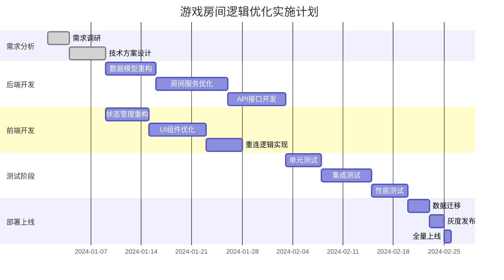

### 里程碑节点

| 里程碑 | 完成标准 | 预期日期 | 责任人 |
|--------|---------|---------|--------|
| 技术方案确认 | 设计文档评审通过 | 第1周 | 架构师 |
| 后端开发完成 | 所有API测试通过 | 第4周 | 后端团队 |
| 前端开发完成 | UI功能测试通过 | 第4周 | 前端团队 |
| 系统测试完成 | 所有测试用例通过 | 第6周 | 测试团队 |
| 正式上线 | 生产环境稳定运行 | 第7周 | 运维团队 |

## 成功指标

### 功能指标

| 指标名称 | 目标值 | 测量方式 | 测量频率 |
|---------|--------|---------|----------|
| 房间创建成功率 | ≥ 99% | 系统日志统计 | 每日 |
| 玩家重连成功率 | ≥ 95% | 用户行为分析 | 每日 |
| 房主权限正确执行率 | ≥ 99% | 功能测试验证 | 每周 |
| 房间列表信息准确性 | 100% | 数据一致性检查 | 每日 |

### 性能指标

| 指标名称 | 目标值 | 当前基线 | 提升目标 |
|---------|--------|---------|----------|
| 房间创建响应时间 | < 200ms | 500ms | 60%提升 |
| 房间列表加载时间 | < 100ms | 300ms | 67%提升 |
| Socket消息延迟 | < 50ms | 100ms | 50%提升 |
| 内存使用效率 | < 80% | 85% | 5%优化 |

### 用户体验指标

| 指标名称 | 目标值 | 测量方式 | 重要程度 |
|---------|--------|---------|----------|
| 用户满意度 | ≥ 4.5/5 | 用户反馈调研 | 高 |
| 房间创建流程完成率 | ≥ 95% | 用户行为漏斗 | 高 |
| 玩家留存率 | ≥ 80% | 数据分析 | 中 |
| 投诉率 | ≤ 1% | 客服记录 | 中 |

## 扩展性考虑

### 水平扩展能力

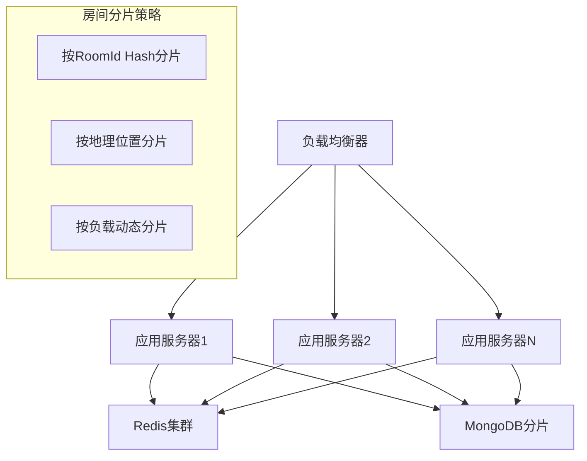

### 功能扩展预留

| 扩展方向 | 预留设计 | 实现难度 | 预期收益 |
|---------|---------|---------|----------|
| 多人房间支持 | maxPlayers参数化 | 低 | 提升游戏趣味性 |
| 房间模板系统 | 配置化房间设置 | 中 | 简化创建流程 |
| 观战功能 | 观察者模式设计 | 中 | 增加用户粘性 |
| 锦标赛模式 | 房间组织层次 | 高 | 提升竞技性 |
| 跨服房间 | 分布式房间管理 | 高 | 扩大用户池 |

### 技术债务管理

| 技术债务类型 | 优先级 | 预估工作量 | 解决计划 |
|-------------|--------|-----------|----------|
| 旧版API兼容 | 中 | 2周 | 逐步迁移 |
| 数据结构冗余 | 低 | 1周 | 下个版本清理 |
| 缓存策略优化 | 高 | 3天 | 立即优化 |
| 监控盲点 | 中 | 1周 | 本版本补充 |