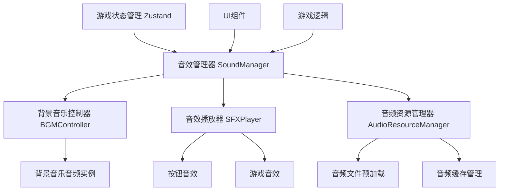
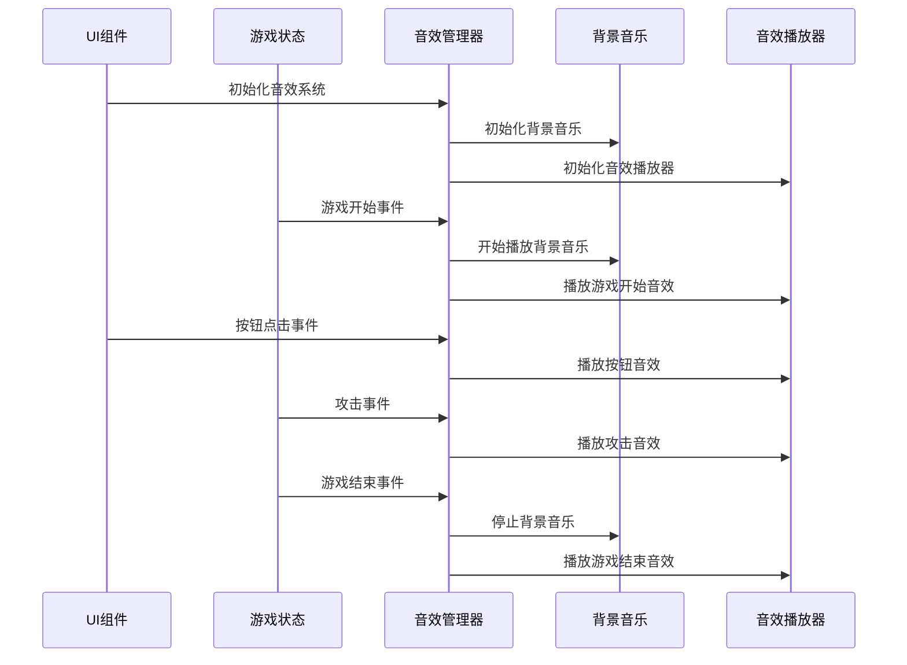
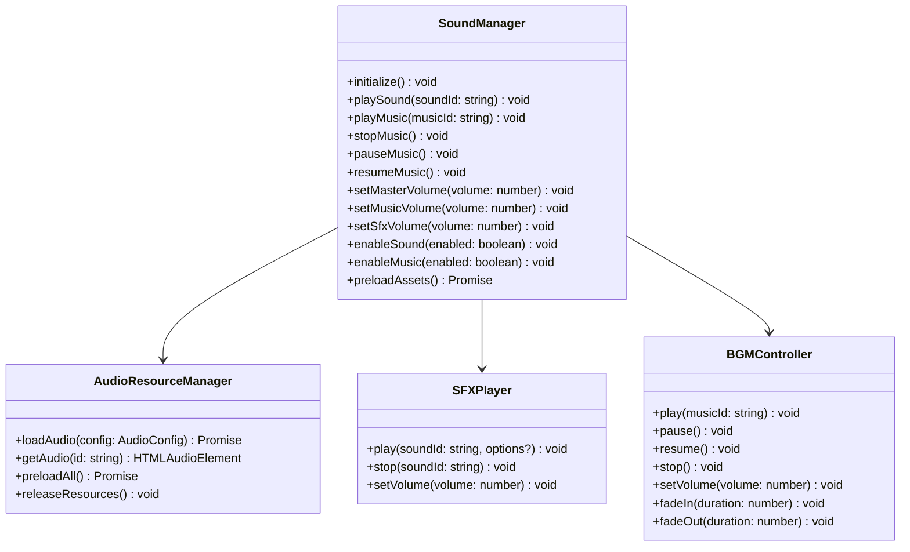
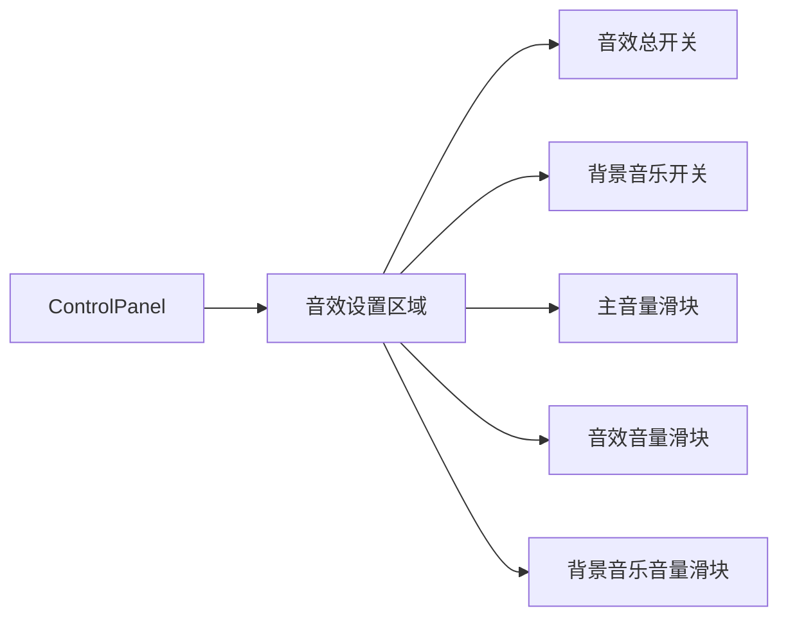
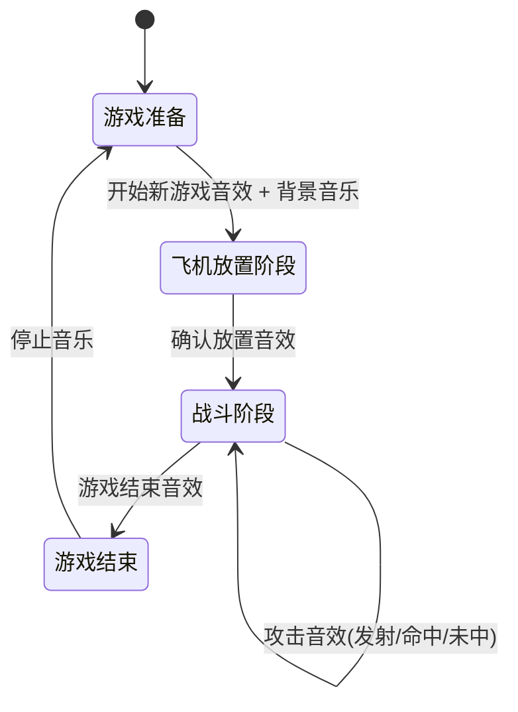
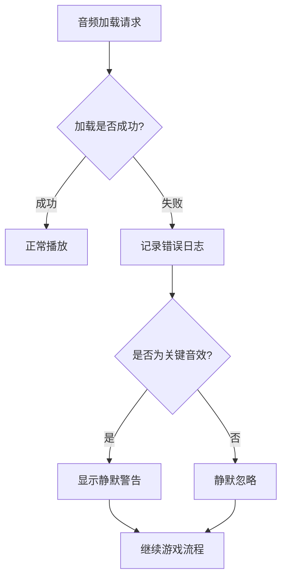

# 游戏音效系统设计文档

## 概述

本设计文档为飞机大战游戏定义音效系统架构，包括背景音乐和各类游戏音效。音效系统将增强用户体验，为游戏的各个关键时刻提供听觉反馈，包括按钮点击、攻击命中、未命中、游戏开始和结束等事件。

## 技术栈与依赖

项目基于现有技术栈：
- React 19.1.1 + TypeScript 5.9.2
- Zustand 5.0.8 状态管理
- Ant Design 5.27.4 UI组件库
- Vite 5.0.0 构建工具

音效系统将使用Web Audio API和HTML5 Audio元素实现，无需引入额外的第三方音频库。

## 架构设计

### 音效系统整体架构



### 组件交互关系



## 音效分类与规格

### 背景音乐规格

| 音乐类型 | 文件格式 | 时长 | 循环方式 | 音量控制 |
|---------|---------|------|---------|----------|
| 游戏主背景音乐 | MP3/OGG | 2-3分钟 | 无缝循环 | 可调节 |
| 胜利音乐 | MP3/OGG | 10-15秒 | 单次播放 | 可调节 |
| 失败音乐 | MP3/OGG | 10-15秒 | 单次播放 | 可调节 |

### 音效规格

| 音效类型 | 文件格式 | 时长 | 触发时机 | 音量特性 |
|---------|---------|------|---------|----------|
| 按钮点击 | MP3/WAV | 0.1-0.3秒 | 所有按钮交互 | 短促清脆 |
| 攻击发射 | MP3/WAV | 0.5-1秒 | 玩家点击攻击位置 | 中等音量 |
| 击中机身 | MP3/WAV | 0.3-0.8秒 | 命中飞机非机头部位 | 中高音量 |
| 击中机头 | MP3/WAV | 1-2秒 | 命中飞机机头 | 高音量 |
| 攻击未中 | MP3/WAV | 0.3-0.6秒 | 攻击空位置 | 中低音量 |
| 游戏开始 | MP3/WAV | 1-2秒 | 开始新游戏 | 中等音量 |
| 游戏胜利 | MP3/WAV | 2-3秒 | 玩家获胜 | 高音量 |
| 游戏失败 | MP3/WAV | 2-3秒 | 玩家失败 | 中等音量 |
| 飞机放置确认 | MP3/WAV | 0.5-1秒 | 确认飞机位置 | 中等音量 |

## 数据模型设计

### 音效配置数据模型

| 字段名 | 类型 | 描述 | 默认值 |
|--------|------|------|--------|
| soundEnabled | boolean | 音效总开关 | true |
| musicEnabled | boolean | 背景音乐开关 | true |
| masterVolume | number | 主音量(0-1) | 0.7 |
| musicVolume | number | 背景音乐音量(0-1) | 0.5 |
| sfxVolume | number | 音效音量(0-1) | 0.8 |
| soundQuality | string | 音质设置(low/medium/high) | medium |

### 音频资源数据模型

| 字段名 | 类型 | 描述 | 示例值 |
|--------|------|------|--------|
| id | string | 音频唯一标识 | button_click |
| name | string | 音频显示名称 | 按钮点击音效 |
| url | string | 音频文件路径 | /assets/sounds/button_click.mp3 |
| type | enum | 音频类型(bgm/sfx) | sfx |
| preload | boolean | 是否预加载 | true |
| volume | number | 默认音量(0-1) | 0.8 |
| loop | boolean | 是否循环播放 | false |

## 音效系统核心模块设计

### 音效管理器接口规范

音效管理器作为系统核心，提供统一的音效控制接口：



### 音效触发事件映射

| 游戏事件 | 触发条件 | 音效类型 | 调用方式 |
|---------|---------|---------|----------|
| 开始新游戏 | startNewGame调用 | 游戏开始音效 + 背景音乐 | SoundManager.playSound('game_start') |
| 重置游戏 | resetGame调用 | 按钮点击音效 | SoundManager.playSound('button_click') |
| 确认飞机放置 | confirmPlacement调用 | 确认音效 | SoundManager.playSound('airplane_confirm') |
| 发起攻击 | attack调用前 | 攻击发射音效 | SoundManager.playSound('attack_launch') |
| 攻击命中机身 | attack返回hit_body | 击中音效 | SoundManager.playSound('hit_body') |
| 攻击命中机头 | attack返回hit_head | 致命一击音效 | SoundManager.playSound('hit_head') |
| 攻击未命中 | attack返回miss | 未命中音效 | SoundManager.playSound('attack_miss') |
| 游戏胜利 | endGame调用(winner) | 胜利音效 + 胜利音乐 | SoundManager.playSound('game_victory') |
| 游戏失败 | endGame调用(loser) | 失败音效 + 失败音乐 | SoundManager.playSound('game_defeat') |

## 状态管理集成设计

### Zustand Store扩展

在现有gameStore基础上扩展音效相关状态：

| 状态字段 | 类型 | 描述 | 初始值 |
|---------|------|------|--------|
| soundSettings | SoundSettings | 音效设置对象 | 默认配置 |
| isMusicPlaying | boolean | 背景音乐播放状态 | false |
| currentMusic | string \| null | 当前播放音乐ID | null |

### 音效设置持久化

音效设置需要持久化存储到LocalStorage，确保用户配置在页面刷新后保持：

| 存储键名 | 数据类型 | 存储内容 | 示例值 |
|---------|---------|---------|--------|
| airplane_battle_sound_settings | JSON字符串 | 完整音效配置 | {"soundEnabled":true,"musicVolume":0.5} |

## 用户界面集成设计

### 音效控制组件设计

在ControlPanel组件中集成音效控制界面：



### 音效设置界面规范

| 控件类型 | 标签文本 | 控件组件 | 数据绑定 | 交互行为 |
|---------|---------|---------|---------|----------|
| 开关 | 启用音效 | Switch | soundEnabled | 切换时立即播放测试音效 |
| 开关 | 背景音乐 | Switch | musicEnabled | 切换时开始/停止背景音乐 |
| 滑块 | 主音量 | Slider | masterVolume | 拖拽时实时调整所有音量 |
| 滑块 | 音效音量 | Slider | sfxVolume | 拖拽时播放测试音效 |
| 滑块 | 音乐音量 | Slider | musicVolume | 拖拽时实时调整背景音乐音量 |

## 音频资源管理策略

### 资源文件组织结构

```
public/
└── assets/
    └── sounds/
        ├── bgm/
        │   ├── game_background.mp3
        │   ├── victory.mp3
        │   └── defeat.mp3
        └── sfx/
            ├── ui/
            │   └── button_click.wav
            ├── gameplay/
            │   ├── attack_launch.wav
            │   ├── hit_body.wav
            │   ├── hit_head.wav
            │   ├── attack_miss.wav
            │   └── airplane_confirm.wav
            └── events/
                ├── game_start.wav
                ├── game_victory.wav
                └── game_defeat.wav
```

### 音频加载策略

| 加载时机 | 音频类型 | 加载方式 | 缓存策略 |
|---------|---------|---------|----------|
| 应用启动 | 按钮音效 | 预加载 | 内存缓存 |
| 游戏开始 | 背景音乐 | 延迟加载 | 内存缓存 |
| 首次使用 | 游戏音效 | 按需加载 | 内存缓存 |
| 游戏结束 | 结束音效 | 预加载 | 内存缓存 |

### 性能优化策略

| 优化方案 | 实现方式 | 效果 | 适用场景 |
|---------|---------|------|---------|
| 音频压缩 | 使用适当的比特率 | 减少文件大小 | 所有音频文件 |
| 格式兼容 | 提供MP3+OGG格式 | 跨浏览器兼容 | 背景音乐 |
| 懒加载 | 按需加载音效 | 减少初始加载时间 | 低频使用音效 |
| 音频池 | 重用音频实例 | 避免频繁创建/销毁 | 高频音效 |
| 错误处理 | 静默失败机制 | 保证游戏正常运行 | 所有音频播放 |

## 游戏流程集成

### 游戏生命周期音效映射



### 用户交互音效反馈

| 交互类型 | 触发元素 | 音效反馈 | 视觉反馈配合 |
|---------|---------|---------|-------------|
| 按钮点击 | 所有Button组件 | 轻快点击音 | 按钮状态变化 |
| 网格点击 | GridCell组件 | 攻击发射音 | 网格状态更新 |
| 设置调整 | 音量滑块 | 测试音效 | 滑块位置变化 |
| 模式选择 | Select组件 | 选择确认音 | 选项高亮 |

## 错误处理与降级策略

### 音频加载失败处理



### 浏览器兼容性降级

| 浏览器特性 | 降级策略 | 兼容范围 | 实现方式 |
|-----------|---------|---------|----------|
| Web Audio API不支持 | 使用HTML5 Audio | 现代浏览器 | 特性检测 + 回退 |
| 音频格式不支持 | 多格式提供 | 全浏览器 | 格式检测 + 回退 |
| 自动播放限制 | 用户交互后播放 | 移动端浏览器 | 事件触发播放 |
| 内存限制 | 减少预加载数量 | 低端设备 | 动态资源管理 |

## 测试策略

### 音效功能测试用例

| 测试场景 | 测试步骤 | 预期结果 | 验证方法 |
|---------|---------|---------|----------|
| 音效开关控制 | 关闭音效总开关后点击按钮 | 无音效播放 | 听觉验证 |
| 音量调节 | 调整主音量滑块 | 所有音效音量同步变化 | 听觉验证 |
| 背景音乐循环 | 播放背景音乐超过一个周期 | 音乐无缝循环播放 | 听觉验证 |
| 同时播放多个音效 | 快速连续点击多个按钮 | 音效正常叠加播放 | 听觉验证 |
| 音效设置持久化 | 调整设置后刷新页面 | 设置保持不变 | 功能验证 |

### 性能测试指标

| 性能指标 | 测试方法 | 目标值 | 监控方式 |
|---------|---------|-------|----------|
| 音频加载时间 | 网络面板监控 | <2秒 | 开发者工具 |
| 内存占用 | 内存面板监控 | <50MB | 开发者工具 |
| 音效延迟 | 用户操作到音效播放 | <100ms | 性能测试工具 |
| CPU占用 | 性能分析器 | <5% | 浏览器性能工具 |

## 部署与维护

### 音频资源部署策略

| 部署环境 | CDN配置 | 缓存策略 | 版本管理 |
|---------|---------|---------|----------|
| 生产环境 | 启用音频CDN | 长期缓存(30天) | 文件名哈希 |
| 测试环境 | 本地资源 | 短期缓存(1天) | 版本号控制 |
| 开发环境 | 本地资源 | 禁用缓存 | 实时更新 |

### 监控与维护

| 监控项目 | 监控方式 | 告警阈值 | 处理策略 |
|---------|---------|---------|----------|
| 音频加载失败率 | 错误日志统计 | >5% | 检查资源可用性 |
| 用户音效设置分布 | 用户行为分析 | - | 优化默认配置 |
| 浏览器兼容性问题 | 错误报告收集 | 出现新问题 | 更新兼容性代码 |
| 性能影响 | 性能监控工具 | 页面加载时间增加>20% | 优化资源加载 |