# MongoDB迁移与Debian部署设计文档

## 项目概述

本设计文档规划了飞机大战游戏服务端项目的两项核心优化：
1. 将数据存储从PostgreSQL迁移至MongoDB
2. 在Debian 12系统环境中实现完整的生产部署

### 项目背景
现有项目采用Express + TypeScript + PostgreSQL + Redis技术栈，支持多人实时飞机大战游戏，包含用户管理、房间管理、游戏状态管理等核心功能。

### 优化目标
- **数据库现代化**：采用MongoDB提供更灵活的文档存储和更好的水平扩展能力
- **生产就绪部署**：在Debian 12环境中建立稳定、可维护的生产部署方案

## 系统架构设计

### 整体架构图

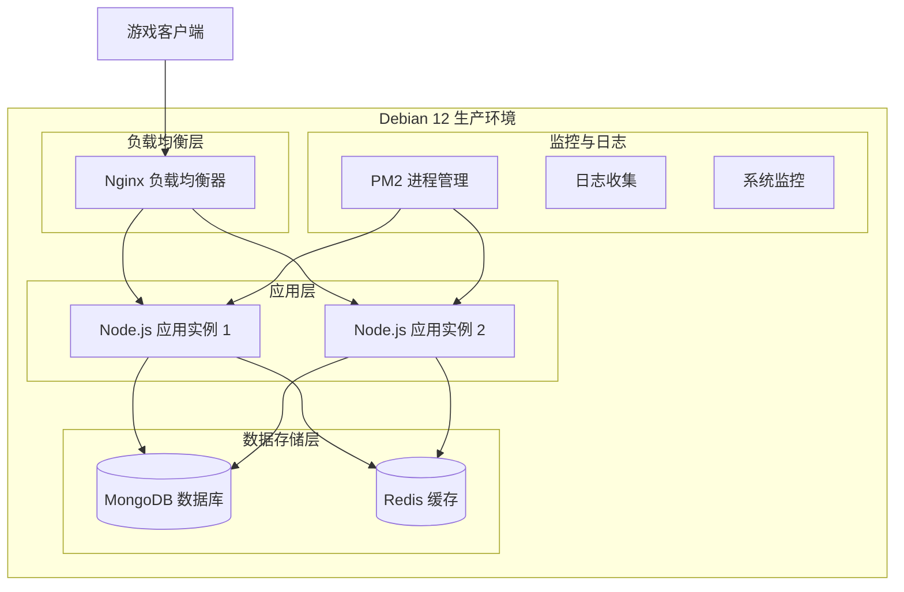

### 技术栈演进

| 组件 | 现有技术 | 目标技术 | 迁移原因 |
|------|----------|----------|----------|
| 数据库 | PostgreSQL | MongoDB | 文档存储更适合游戏数据结构，水平扩展能力更强 |
| ORM/ODM | 原生SQL | Mongoose | 提供结构化的数据模型和验证 |
| 部署环境 | 开发环境 | Debian 12 生产环境 | 稳定的生产级Linux发行版 |
| 进程管理 | 手动启动 | PM2 | 自动重启、负载均衡、监控 |
| 反向代理 | 无 | Nginx | 负载均衡、SSL终止、静态资源服务 |

## MongoDB数据模型设计

### 数据模型映射策略

#### 用户集合 (users)
```
{
  _id: ObjectId,
  userId: UUID (索引),
  username: String (唯一索引),
  email: String (唯一索引),
  passwordHash: String,
  displayName: String,
  avatarUrl: String,
  level: Number,
  experience: Number,
  wins: Number,
  losses: Number,
  rating: Number,
  isActive: Boolean,
  createdAt: Date,
  lastLogin: Date
}
```

#### 房间集合 (rooms)
```
{
  _id: ObjectId,
  roomId: UUID (索引),
  roomName: String,
  roomType: String, // 'public' | 'private'
  password: String,
  maxPlayers: Number,
  currentPlayers: Number,
  status: String, // 'waiting' | 'playing' | 'finished'
  hostUserId: UUID (引用 users.userId),
  members: [
    {
      userId: UUID,
      playerNumber: Number,
      isReady: Boolean,
      joinedAt: Date
    }
  ],
  createdAt: Date,
  updatedAt: Date
}
```

#### 游戏记录集合 (games)
```
{
  _id: ObjectId,
  gameId: UUID (索引),
  roomId: UUID (引用 rooms.roomId),
  player1Id: UUID,
  player2Id: UUID,
  winnerId: UUID,
  currentPhase: String, // 'waiting' | 'placement' | 'battle' | 'finished'
  currentPlayer: Number,
  turnCount: Number,
  gameDuration: Number,
  player1Airplane: Object,
  player2Airplane: Object,
  attackHistory: Array,
  startedAt: Date,
  finishedAt: Date
}
```

#### 用户会话集合 (userSessions)
```
{
  _id: ObjectId,
  sessionId: UUID (索引),
  userId: UUID (引用 users.userId),
  refreshToken: String (索引),
  ipAddress: String,
  userAgent: String,
  isActive: Boolean,
  createdAt: Date,
  expiresAt: Date
}
```

### 索引设计策略

| 集合 | 索引类型 | 字段 | 用途 |
|------|----------|------|------|
| users | 唯一索引 | userId | 主键查询 |
| users | 唯一索引 | username | 用户名查询 |
| users | 唯一索引 | email | 邮箱查询 |
| users | 复合索引 | rating, -createdAt | 排行榜查询 |
| rooms | 单字段索引 | roomId | 房间查询 |
| rooms | 复合索引 | status, createdAt | 房间列表查询 |
| rooms | 单字段索引 | hostUserId | 主机查询 |
| games | 单字段索引 | gameId | 游戏查询 |
| games | 复合索引 | player1Id, startedAt | 玩家历史记录 |
| games | 复合索引 | player2Id, startedAt | 玩家历史记录 |
| userSessions | 单字段索引 | sessionId | 会话查询 |
| userSessions | 单字段索引 | refreshToken | Token验证 |
| userSessions | TTL索引 | expiresAt | 自动过期清理 |

## 数据迁移策略

### 迁移架构设计

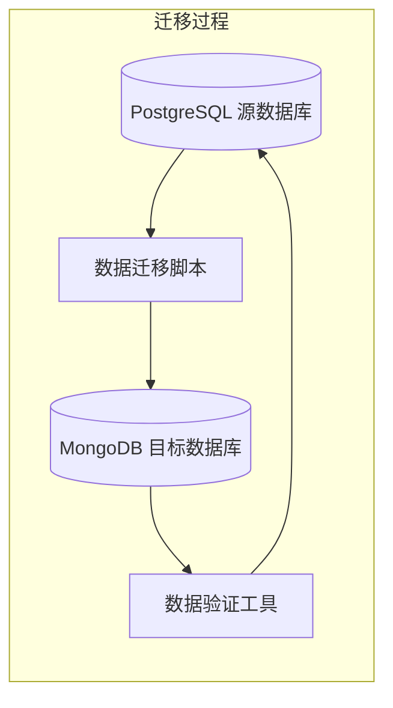

### 迁移实施流程

#### 阶段一：准备阶段
1. **环境准备**
   - 安装MongoDB和相关依赖
   - 配置MongoDB连接和认证
   - 部署数据迁移工具

2. **数据分析**
   - 分析现有PostgreSQL数据结构
   - 识别数据关系和约束
   - 制定数据转换规则

#### 阶段二：迁移执行
1. **Schema迁移**
   - 创建MongoDB集合和索引
   - 设置数据验证规则
   - 配置分片策略（如需要）

2. **数据转换迁移**
   - 批量迁移历史数据
   - 处理数据类型转换
   - 维护数据完整性

3. **增量数据同步**
   - 实现实时数据同步机制
   - 处理迁移期间的新增数据
   - 确保数据一致性

#### 阶段三：验证与切换
1. **数据验证**
   - 比对源数据和目标数据
   - 验证数据完整性和正确性
   - 执行功能测试

2. **应用切换**
   - 更新应用配置
   - 切换数据库连接
   - 验证应用功能

### 数据迁移映射表

| PostgreSQL表 | MongoDB集合 | 特殊处理 |
|---------------|-------------|----------|
| users | users | UUID转换，枚举类型映射 |
| rooms | rooms | 关联数据嵌入，状态映射 |
| room_members | rooms.members | 嵌入到rooms集合中 |
| games | games | JSON字段保持不变 |
| user_sessions | userSessions | 添加TTL索引 |

## 应用架构重构

### 数据访问层重构

#### MongoDB连接管理器
- 替换PostgreSQL连接池为MongoDB连接管理
- 实现连接池配置和监控
- 支持读写分离和负载均衡

#### 数据模型层
- 使用Mongoose定义数据Schema
- 实现数据验证和中间件
- 支持关联查询和聚合操作

#### 服务层适配
- 重构UserService以支持MongoDB操作
- 重构RoomService以支持文档查询
- 重构GameService以支持复杂聚合

### 配置管理重构

#### 数据库配置
```
database: {
  type: 'mongodb',
  host: process.env.MONGO_HOST,
  port: process.env.MONGO_PORT,
  database: process.env.MONGO_DATABASE,
  username: process.env.MONGO_USERNAME,
  password: process.env.MONGO_PASSWORD,
  options: {
    authSource: 'admin',
    ssl: true,
    replicaSet: 'rs0'
  }
}
```

#### 连接配置
- 配置连接池大小和超时
- 设置读写分离策略
- 配置故障转移机制

## Debian 12部署架构

### 系统架构设计

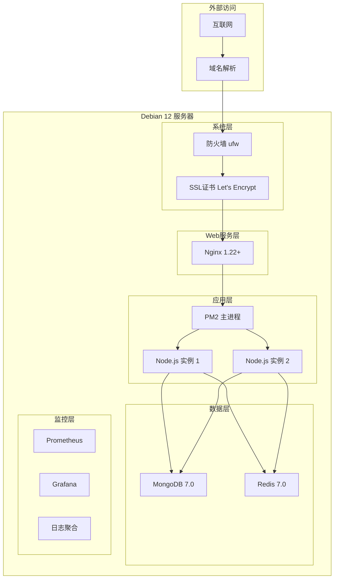

### 系统环境配置

#### 基础系统要求
| 组件 | 最低配置 | 推荐配置 | 用途 |
|------|----------|----------|------|
| CPU | 2核心 | 4核心 | 应用计算和数据库操作 |
| 内存 | 4GB | 8GB | 应用运行和数据库缓存 |
| 存储 | 50GB SSD | 100GB SSD | 系统、应用、数据存储 |
| 网络 | 10Mbps | 100Mbps | 游戏实时通信需求 |

#### 软件依赖版本
| 软件 | 版本要求 | 安装来源 |
|------|----------|----------|
| Debian | 12.0+ | 官方镜像 |
| Node.js | 18.0+ | NodeSource仓库 |
| MongoDB | 7.0+ | MongoDB官方仓库 |
| Redis | 7.0+ | Debian官方仓库 |
| Nginx | 1.22+ | Debian官方仓库 |
| PM2 | 最新版 | npm全局安装 |

### 部署流程设计

#### 第一阶段：系统初始化
1. **系统更新和基础配置**
   - 更新系统包管理器
   - 配置时区和本地化
   - 设置主机名和网络

2. **安全配置**
   - 配置SSH密钥认证
   - 设置防火墙规则
   - 创建专用用户账户

3. **依赖安装**
   - 安装Node.js运行环境
   - 安装MongoDB数据库
   - 安装Redis缓存服务
   - 安装Nginx Web服务器

#### 第二阶段：服务配置
1. **MongoDB配置**
   - 配置数据目录和日志
   - 设置认证和访问控制
   - 创建数据库和用户
   - 配置复制集（可选）

2. **Redis配置**
   - 配置内存和持久化
   - 设置访问密码
   - 配置网络绑定

3. **Nginx配置**
   - 配置反向代理
   - 设置负载均衡
   - 配置SSL证书
   - 配置静态资源服务

#### 第三阶段：应用部署
1. **应用代码部署**
   - 克隆代码仓库
   - 安装项目依赖
   - 构建生产版本
   - 配置环境变量

2. **PM2进程管理**
   - 配置PM2生态文件
   - 设置集群模式
   - 配置自动重启策略
   - 设置日志管理

3. **服务启动和验证**
   - 启动所有服务
   - 验证服务状态
   - 执行健康检查
   - 配置监控告警

### 配置文件模板

#### Nginx配置策略
```
upstream nodejs_backend {
    server 127.0.0.1:3001;
    server 127.0.0.1:3002;
}

server {
    listen 80;
    server_name yourdomain.com;
    return 301 https://$server_name$request_uri;
}

server {
    listen 443 ssl http2;
    server_name yourdomain.com;
    
    ssl_certificate /etc/ssl/certs/yourdomain.com.pem;
    ssl_certificate_key /etc/ssl/private/yourdomain.com.key;
    
    location / {
        proxy_pass http://nodejs_backend;
        proxy_http_version 1.1;
        proxy_set_header Upgrade $http_upgrade;
        proxy_set_header Connection 'upgrade';
        proxy_set_header Host $host;
        proxy_set_header X-Real-IP $remote_addr;
        proxy_set_header X-Forwarded-For $proxy_add_x_forwarded_for;
        proxy_set_header X-Forwarded-Proto $scheme;
        proxy_cache_bypass $http_upgrade;
    }
}
```

#### PM2生态配置
```
module.exports = {
  apps: [
    {
      name: 'airplane-battle-api',
      script: './dist/server.js',
      instances: 2,
      exec_mode: 'cluster',
      env: {
        NODE_ENV: 'production',
        PORT: 3001
      },
      env_production: {
        NODE_ENV: 'production',
        PORT: 3001
      },
      log_file: './logs/combined.log',
      out_file: './logs/out.log',
      error_file: './logs/error.log',
      merge_logs: true,
      time: true
    }
  ]
}
```

#### MongoDB配置要点
```
storage:
  dbPath: /var/lib/mongodb
  journal:
    enabled: true

systemLog:
  destination: file
  logAppend: true
  path: /var/log/mongodb/mongod.log

net:
  port: 27017
  bindIp: 127.0.0.1

security:
  authorization: enabled

replication:
  replSetName: rs0
```

## 监控与运维

### 监控架构

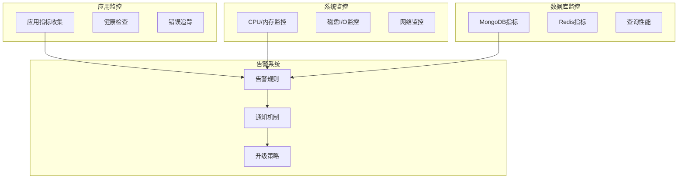

### 监控指标设计

#### 应用层监控
| 指标类型 | 具体指标 | 告警阈值 | 处理策略 |
|----------|----------|----------|----------|
| 响应时间 | API平均响应时间 | >500ms | 性能调优 |
| 错误率 | HTTP 5xx错误率 | >5% | 立即调查 |
| 并发连接 | WebSocket连接数 | >1000 | 扩容评估 |
| 内存使用 | Node.js堆内存 | >80% | 内存泄漏检查 |

#### 系统层监控
| 指标类型 | 具体指标 | 告警阈值 | 处理策略 |
|----------|----------|----------|----------|
| CPU使用率 | 系统CPU平均使用率 | >80% | 资源优化 |
| 内存使用率 | 系统内存使用率 | >85% | 内存清理或扩容 |
| 磁盘空间 | 根分区可用空间 | <20% | 日志清理或扩容 |
| 网络流量 | 入站/出站流量 | 异常峰值 | 攻击检测 |

#### 数据库监控
| 指标类型 | 具体指标 | 告警阈值 | 处理策略 |
|----------|----------|----------|----------|
| 连接数 | MongoDB活跃连接 | >80% | 连接池优化 |
| 查询性能 | 慢查询数量 | >10/min | 索引优化 |
| 复制延迟 | 主从同步延迟 | >1s | 网络或配置检查 |
| 缓存命中率 | Redis缓存命中率 | <80% | 缓存策略调整 |

### 运维流程

#### 日常运维检查表
| 检查项目 | 频率 | 检查内容 | 预期结果 |
|----------|------|----------|----------|
| 服务状态 | 每小时 | 所有服务运行状态 | 全部正常运行 |
| 系统资源 | 每2小时 | CPU、内存、磁盘使用率 | 在安全范围内 |
| 错误日志 | 每4小时 | 应用和系统错误日志 | 无严重错误 |
| 数据库性能 | 每日 | 查询性能和连接状态 | 性能稳定 |
| 安全检查 | 每周 | 登录日志和异常访问 | 无异常活动 |
| 备份验证 | 每周 | 数据备份完整性 | 备份可用 |

#### 故障处理流程

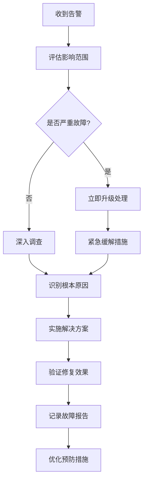

## 安全设计

### 安全架构

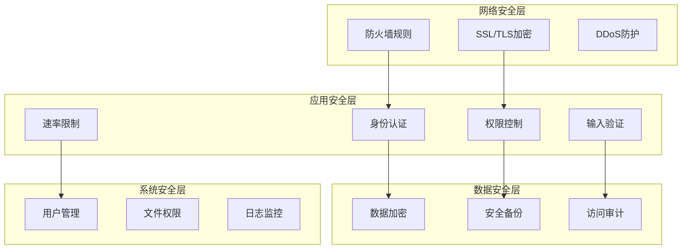

### 安全配置要求

#### 网络安全配置
| 安全措施 | 配置要求 | 实现方式 |
|----------|----------|----------|
| 防火墙 | 仅开放必要端口 | ufw配置22,80,443端口 |
| SSL/TLS | 强制HTTPS访问 | Let's Encrypt证书 |
| 端口访问 | 限制数据库端口访问 | 仅本地访问27017,6379 |
| IP白名单 | 限制管理访问 | 配置SSH访问IP限制 |

#### 应用安全配置
| 安全措施 | 配置要求 | 实现方式 |
|----------|----------|----------|
| 身份认证 | JWT Token机制 | 短期Token + 刷新机制 |
| 密码策略 | 强密码要求 | bcrypt加密存储 |
| 会话管理 | 安全会话控制 | Redis会话存储 |
| 输入验证 | 严格数据验证 | Joi验证中间件 |

#### 数据安全配置
| 安全措施 | 配置要求 | 实现方式 |
|----------|----------|----------|
| 数据加密 | 敏感数据字段加密 | MongoDB字段级加密 |
| 数据备份 | 定期自动备份 | mongodump + 加密存储 |
| 访问审计 | 记录所有数据库操作 | MongoDB审计日志 |
| 权限控制 | 最小权限原则 | 数据库用户角色管理 |

### 备份与恢复策略

#### 备份策略设计

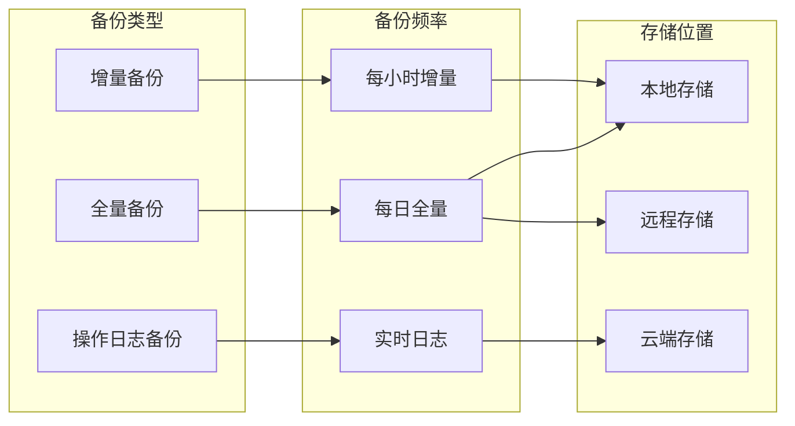

#### 备份配置表

| 备份类型 | 频率 | 保留期 | 存储位置 | 加密方式 |
|----------|------|--------|-----------|-----------|
| 全量备份 | 每日凌晨2点 | 30天 | 本地+远程 | GPG加密 |
| 增量备份 | 每小时 | 7天 | 本地 | GPG加密 |
| 操作日志 | 实时 | 3天 | 云端 | 传输加密 |
| 配置备份 | 每周 | 90天 | 远程 | GPG加密 |

#### 恢复流程设计

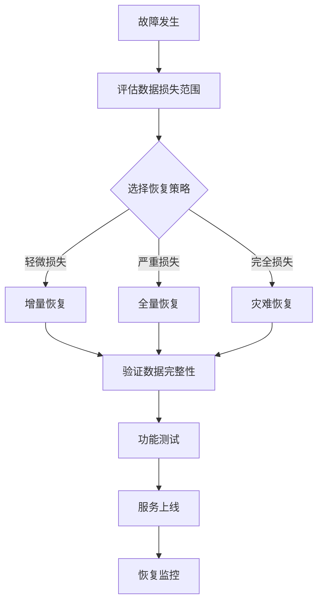

## 性能优化策略

### 数据库性能优化

#### MongoDB优化配置

| 优化项目 | 配置参数 | 推荐值 | 优化目标 |
|----------|----------|--------|-----------|
| 连接池大小 | maxPoolSize | 100 | 控制并发连接 |
| 写关注 | writeConcern | majority | 确保数据一致性 |
| 读偏好 | readPreference | secondaryPreferred | 读写分离 |
| 缓存大小 | wiredTigerCacheSizeGB | 物理内存50% | 提高查询性能 |
| 压缩算法 | blockCompressor | snappy | 减少存储空间 |

#### 查询优化策略

| 优化方向 | 具体措施 | 性能提升 |
|----------|----------|----------|
| 索引优化 | 复合索引设计、索引提示 | 查询速度提升10-100倍 |
| 聚合优化 | Pipeline优化、内存限制 | 聚合查询速度提升5-20倍 |
| 分页优化 | 游标分页、限制结果集 | 大数据集分页提升50% |
| 缓存策略 | 查询结果缓存、热点数据 | 重复查询速度提升80% |

### 应用层性能优化

#### Node.js优化配置

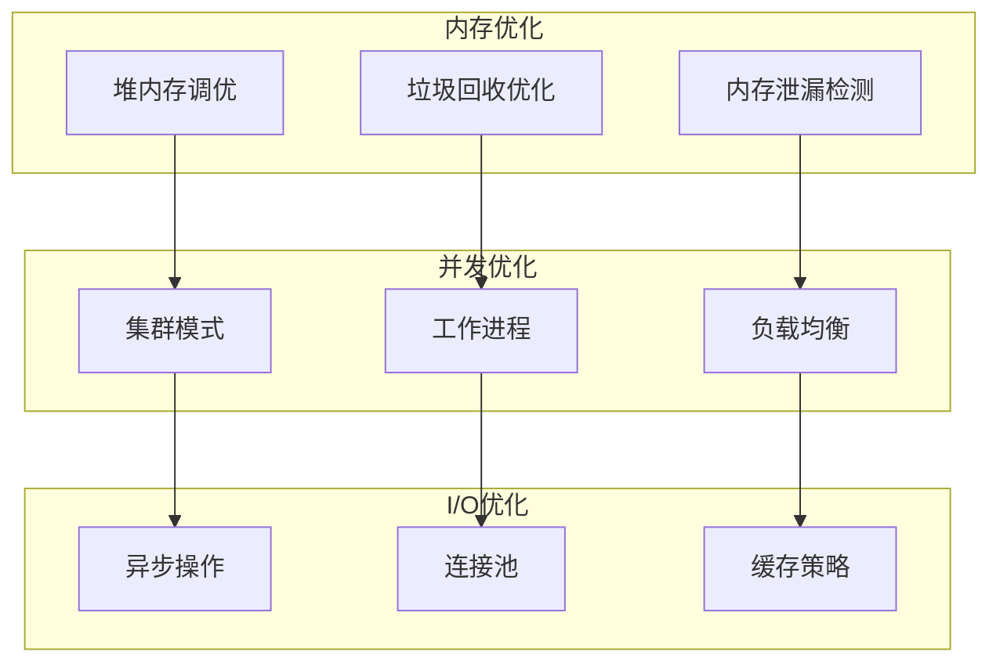

#### 缓存策略设计

| 缓存类型 | 使用场景 | 过期策略 | 性能提升 |
|----------|----------|----------|----------|
| 用户会话缓存 | 登录状态、权限信息 | 24小时TTL | 认证查询提升90% |
| 房间状态缓存 | 活跃房间、玩家信息 | 1小时TTL | 房间查询提升70% |
| 游戏配置缓存 | 静态配置、规则数据 | 手动刷新 | 配置查询提升95% |
| 排行榜缓存 | 用户排名、统计数据 | 15分钟TTL | 排行查询提升80% |

## 扩容与容灾

### 水平扩容设计

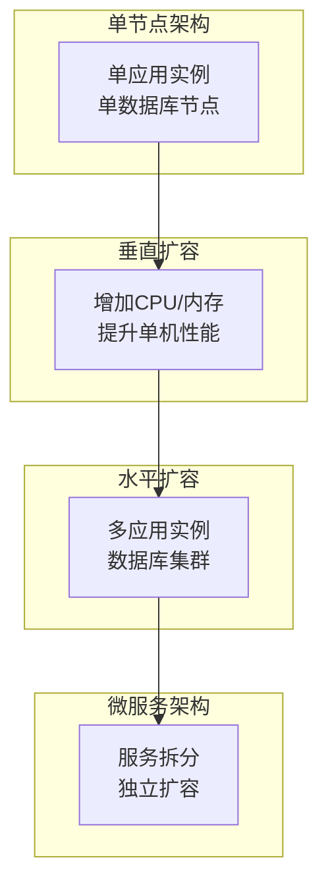

### 扩容触发条件

| 监控指标 | 扩容阈值 | 扩容策略 | 预期效果 |
|----------|----------|----------|----------|
| CPU使用率 | 持续>80%超过10分钟 | 增加应用实例 | 负载分散 |
| 内存使用率 | 持续>85%超过5分钟 | 增加应用实例 | 内存压力缓解 |
| 数据库连接 | 使用率>90% | 增加连接池或副本集 | 连接瓶颈解决 |
| 响应时间 | 平均响应>1秒 | 增加缓存或实例 | 响应速度提升 |
| 并发用户 | 超过设计容量80% | 预先扩容 | 避免性能下降 |

### 容灾架构

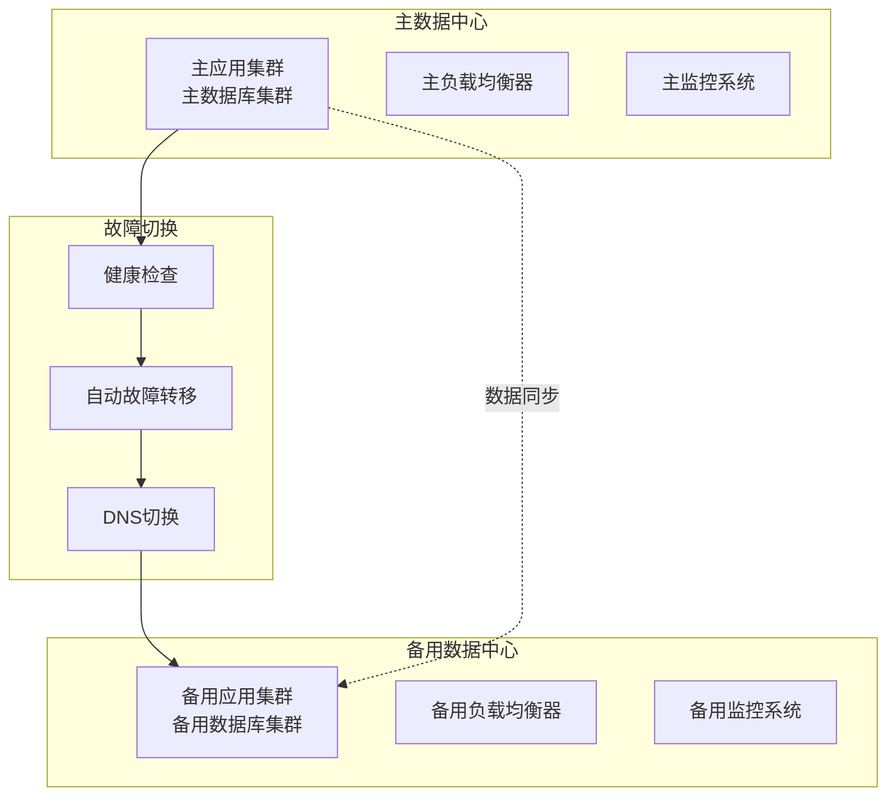

### 容灾策略表

| 故障类型 | 检测方式 | 切换时间 | 数据丢失 | 恢复策略 |
|----------|----------|----------|----------|----------|
| 应用实例故障 | 健康检查失败 | <30秒 | 无 | 自动重启或替换 |
| 数据库主节点故障 | 连接超时 | <2分钟 | 最小 | 自动故障转移 |
| 网络分区 | 心跳检测 | <5分钟 | 可能 | 脑裂防护 |
| 数据中心故障 | 多点检测 | <15分钟 | 最小 | 异地切换 |

## 测试策略

### 测试架构

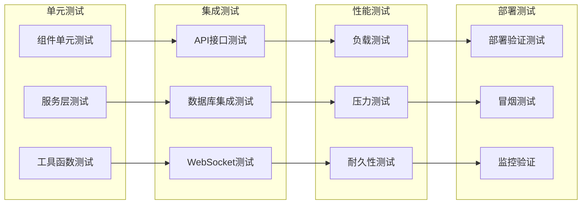

### 测试计划

#### 迁移验证测试

| 测试类型 | 测试内容 | 验收标准 | 负责人 |
|----------|----------|----------|--------|
| 数据完整性测试 | 验证迁移后数据完整性 | 100%数据一致性 | 数据工程师 |
| 功能回归测试 | 验证所有API功能正常 | 所有测试用例通过 | 测试工程师 |
| 性能基准测试 | 对比迁移前后性能 | 性能不下降超过10% | 性能工程师 |
| 安全验证测试 | 验证安全配置生效 | 通过安全扫描 | 安全工程师 |

#### 部署验证测试

| 测试阶段 | 测试环境 | 测试内容 | 通过标准 |
|----------|----------|----------|----------|
| 预部署测试 | 测试环境 | 完整功能验证 | 所有功能正常 |
| 部署验证 | 生产环境 | 服务启动验证 | 所有服务正常启动 |
| 冒烟测试 | 生产环境 | 核心功能验证 | 关键功能可用 |
| 性能验证 | 生产环境 | 性能指标验证 | 满足性能要求 |

### 测试工具和框架

| 测试类型 | 推荐工具 | 配置要求 |
|----------|----------|-----------|
| 单元测试 | Jest + Supertest | 覆盖率>80% |
| API测试 | Postman + Newman | 自动化执行 |
| 性能测试 | Artillery + K6 | 并发用户模拟 |
| 监控测试 | Prometheus + Grafana | 实时指标监控 |

## 项目实施时间线

### 总体时间规划

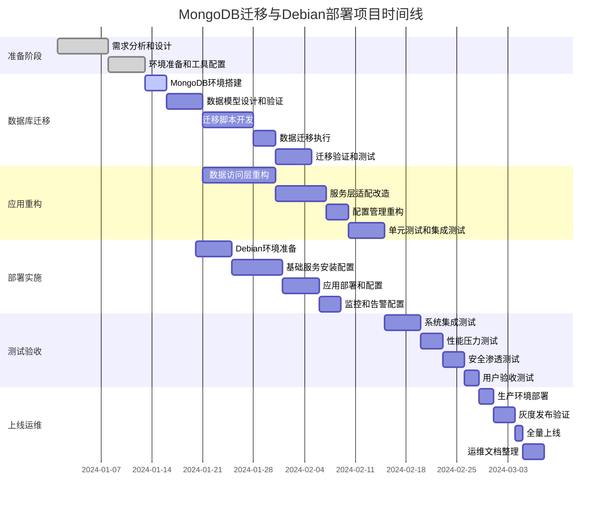

### 关键里程碑

| 里程碑 | 完成时间 | 交付物 | 验收标准 |
|--------|----------|--------|-----------|
| 设计完成 | 第2周 | 详细设计文档 | 设计评审通过 |
| 迁移完成 | 第5周 | 数据迁移报告 | 数据完整性验证通过 |
| 重构完成 | 第7周 | 重构代码和测试报告 | 功能测试通过 |
| 部署完成 | 第9周 | 部署文档和环境 | 环境验收通过 |
| 测试完成 | 第11周 | 测试报告 | 所有测试通过 |
| 正式上线 | 第12周 | 生产系统 | 稳定运行7天 |

### 风险管控

| 风险类型 | 风险描述 | 影响程度 | 应对策略 |
|----------|----------|----------|----------|
| 技术风险 | MongoDB迁移数据丢失 | 高 | 详细测试+回滚方案 |
| 进度风险 | 迁移时间超预期 | 中 | 分阶段实施+并行开发 |
| 资源风险 | 人员不足或技能缺失 | 中 | 提前培训+外部支持 |
| 质量风险 | 性能不达标 | 高 | 性能基准测试+优化 |
| 运维风险 | 部署后稳定性问题 | 高 | 灰度发布+监控告警 |