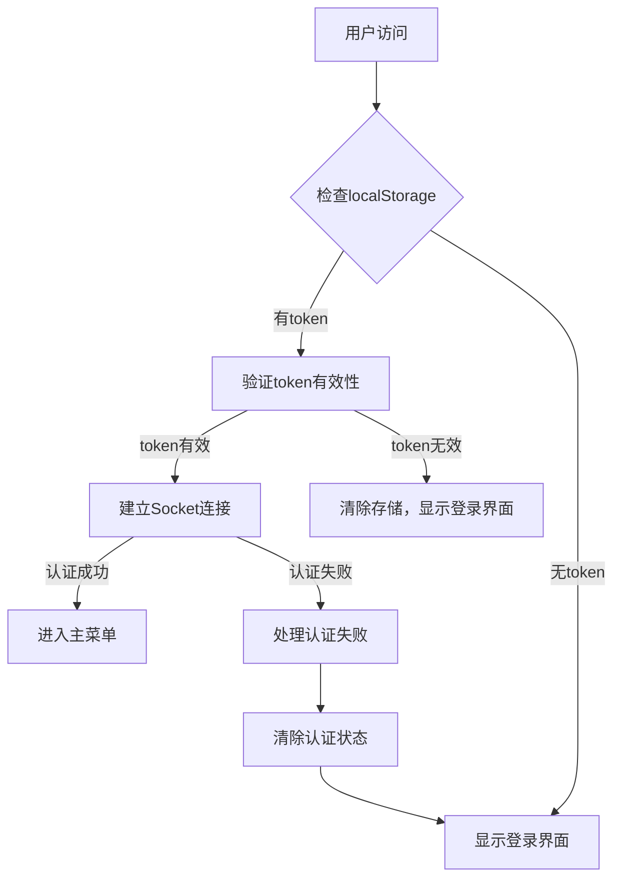
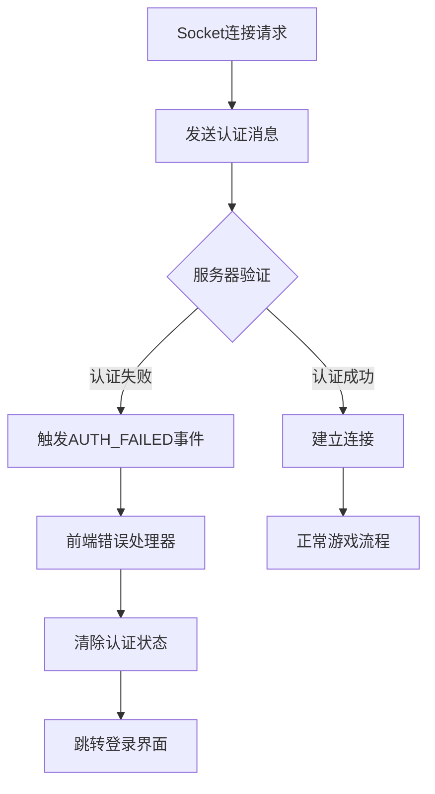
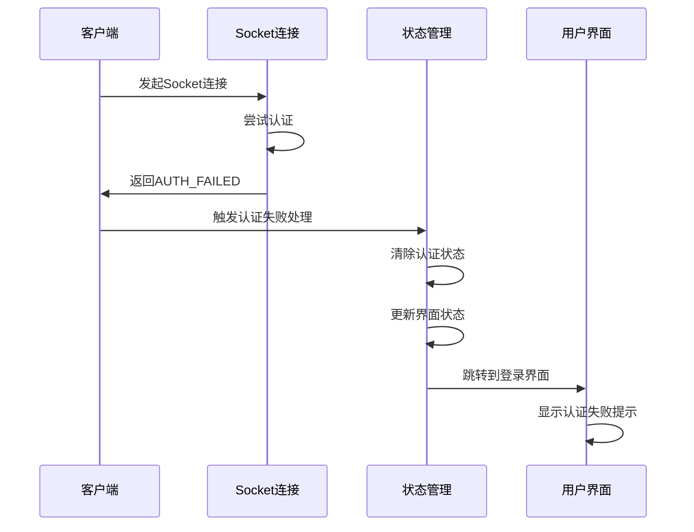
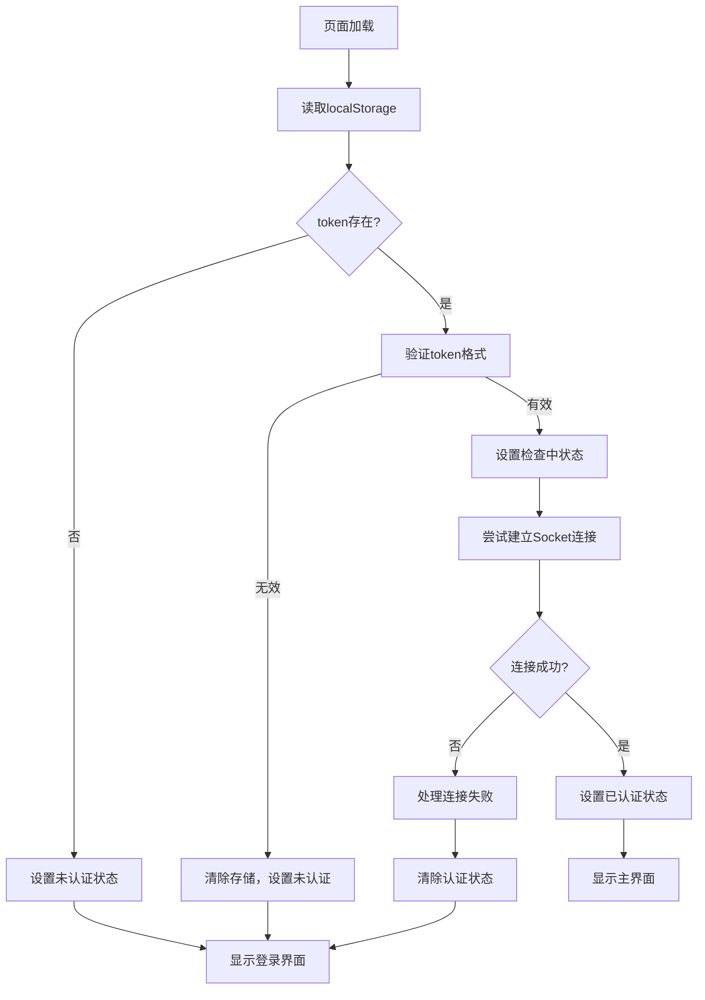
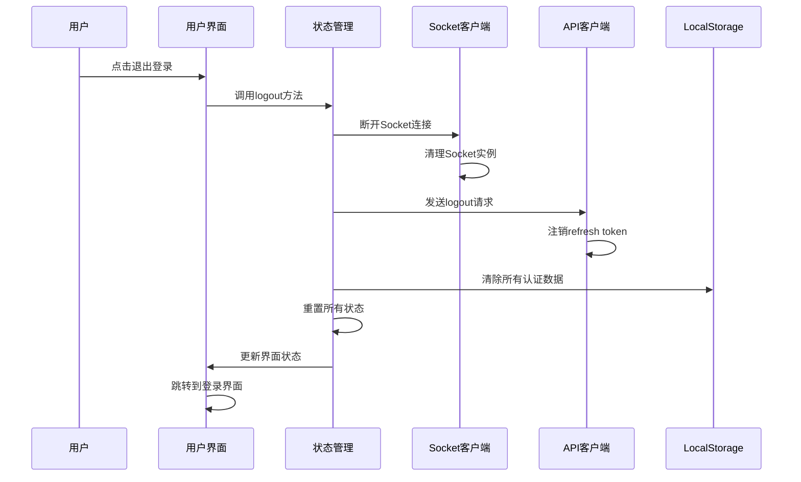
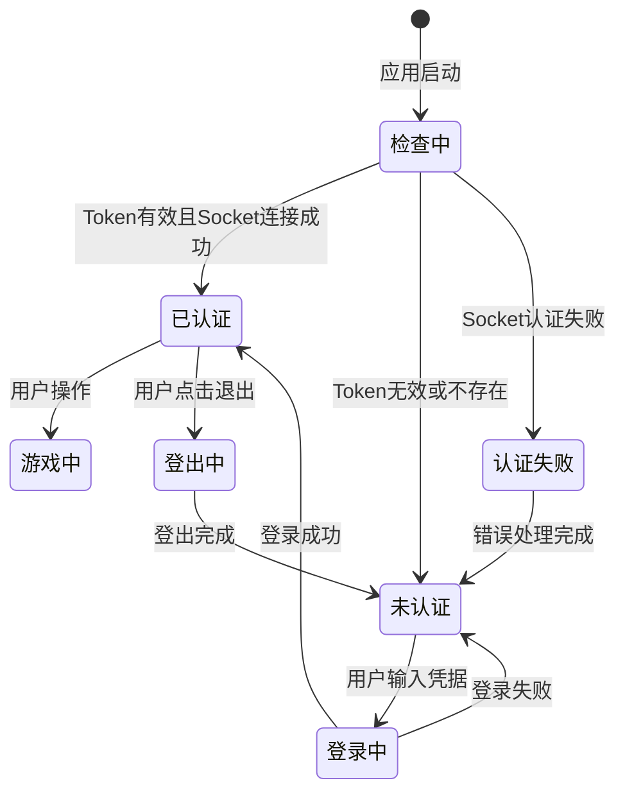
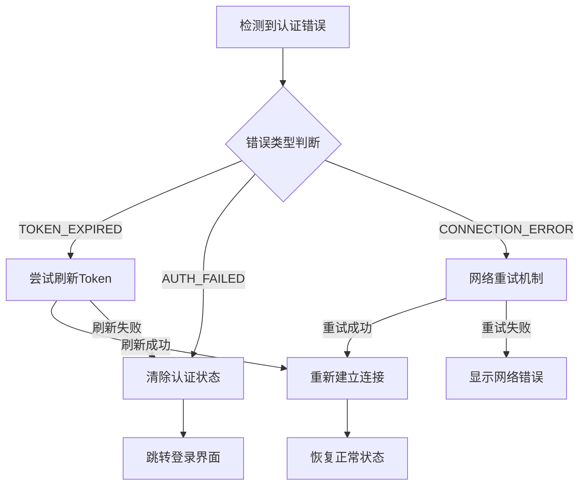

# 飞机大战登录/退出登录流程优化设计

## 概述

本设计文档针对飞机大战游戏中存在的登录/退出登录流程问题进行优化。主要解决用户退出登录后刷新页面时出现Socket认证失败的问题，确保用户在退出登录后能够正确跳转到登录界面，避免出现认证错误和页面状态不一致的情况。

## 问题分析

### 当前问题描述
玩家登录游戏后，点击退出登录，然后按F5刷新页面时会出现以下错误：
```
index-ArjscqbB.js:20 Socket错误: {code: 'AUTH_FAILED', message: '认证失败'}
```

### 问题根因分析

通过代码分析，发现问题的根本原因是：

1. **Token清理时机不当**：用户退出登录时，前端清除了localStorage中的认证信息，但Socket连接可能仍在尝试使用旧token进行认证

2. **页面刷新时的状态恢复逻辑有缺陷**：在App初始化时，会尝试从localStorage恢复用户状态，但当token已被清除时，仍然可能触发Socket连接

3. **Socket错误处理不完善**：当Socket认证失败时，没有正确处理AUTH_FAILED错误，导致用户停留在错误状态而不是跳转到登录页面

4. **状态管理不一致**：前端状态管理中的认证状态与实际的Socket连接状态不同步

## 系统架构

### 认证流程架构



### Socket连接管理架构



## 优化方案设计

### 认证状态管理优化

#### 状态管理结构

| 状态字段 | 类型 | 描述 | 默认值 |
|---------|------|------|--------|
| isAuthenticated | boolean | 用户是否已认证 | false |
| authenticationStatus | AuthStatus | 认证状态枚举 | 'CHECKING' |
| user | UserProfile \| null | 用户信息 | null |
| token | string \| null | 访问令牌 | null |
| refreshToken | string \| null | 刷新令牌 | null |
| socketAuthStatus | SocketAuthStatus | Socket认证状态 | 'DISCONNECTED' |

#### 认证状态枚举定义

| 状态值 | 描述 |
|--------|------|
| CHECKING | 正在检查认证状态 |
| AUTHENTICATED | 已认证 |
| UNAUTHENTICATED | 未认证 |
| TOKEN_EXPIRED | Token已过期 |
| AUTH_FAILED | 认证失败 |

### Socket错误处理机制优化

#### 错误处理流程



#### 错误处理策略表

| 错误类型 | 处理策略 | 用户提示 | 跳转目标 |
|----------|----------|----------|----------|
| AUTH_FAILED | 清除认证状态，跳转登录 | "登录已过期，请重新登录" | 登录界面 |
| TOKEN_EXPIRED | 尝试刷新token，失败则跳转登录 | "登录已过期，请重新登录" | 登录界面 |
| MISSING_TOKEN | 清除认证状态，跳转登录 | "请先登录" | 登录界面 |
| CONNECTION_ERROR | 显示连接错误，允许重试 | "连接失败，请检查网络" | 当前界面 |

### 页面刷新处理优化

#### 初始化流程优化



### 退出登录流程优化

#### 优化后的退出登录流程



## 实现方案

### 前端状态管理层改进

#### NetworkStore状态管理增强

在现有NetworkStore基础上添加以下状态管理逻辑：

1. **认证状态检查机制**
   - 在应用初始化时进行完整的认证状态检查
   - 验证token的有效性和格式
   - 确保Socket连接状态与认证状态同步

2. **Socket错误处理器**
   - 监听所有Socket认证相关错误
   - 实现统一的错误处理逻辑
   - 确保错误处理后的状态一致性

3. **页面刷新状态恢复**
   - 优化initialize方法的错误处理
   - 添加token有效性预检查
   - 完善异常情况下的状态清理

### Socket客户端层改进

#### SocketClient连接管理优化

1. **连接状态管理**
   - 添加连接状态的详细跟踪
   - 实现连接失败时的状态清理
   - 优化重连逻辑，避免无效重连

2. **认证错误处理**
   - 专门处理AUTH_FAILED、TOKEN_EXPIRED等认证错误
   - 实现认证失败时的回调机制
   - 确保认证失败后不会继续尝试重连

3. **连接清理机制**
   - 在disconnect时彻底清理连接状态
   - 清理所有事件监听器
   - 重置连接相关的内部状态

### 应用层初始化优化

#### App组件初始化流程改进

1. **渐进式初始化**
   - 实现应用启动时的渐进式状态检查
   - 添加初始化状态的UI指示
   - 确保初始化过程中的用户体验

2. **错误边界处理**
   - 添加认证错误的边界处理
   - 实现错误状态的恢复机制
   - 提供用户友好的错误提示

## 用户体验优化

### 界面状态管理

#### 加载状态指示



### 错误提示设计

#### 错误消息映射表

| 错误场景 | 用户友好消息 | 行动建议 |
|----------|--------------|----------|
| 页面刷新后认证失败 | "登录状态已过期，请重新登录" | 显示登录表单 |
| Socket连接认证失败 | "连接已断开，请重新登录" | 自动跳转登录页 |
| Token过期 | "登录已过期，请重新登录" | 清除状态，显示登录表单 |
| 网络连接失败 | "网络连接失败，请检查网络后重试" | 提供重试按钮 |

## 技术方案细节

### 状态同步机制

#### 认证状态同步流程

1. **单向数据流**
   - localStorage作为持久化存储
   - NetworkStore作为状态管理中心
   - 各组件通过订阅获取状态更新

2. **状态一致性保证**
   - 所有认证状态更新都通过统一的action进行
   - 确保localStorage、内存状态、Socket状态的一致性
   - 实现状态变更的原子性操作

### 错误恢复机制

#### 自动恢复策略



## 测试策略

### 功能测试场景

#### 认证流程测试

| 测试场景 | 预期结果 | 验证点 |
|----------|----------|--------|
| 正常登录后刷新页面 | 保持登录状态，进入主菜单 | 状态持久化正确 |
| 退出登录后刷新页面 | 显示登录界面，无认证错误 | 状态清理完整 |
| Token过期时的处理 | 自动跳转登录，显示过期提示 | 错误处理准确 |
| 网络断开重连 | 自动重连或提示网络错误 | 重连逻辑正确 |

#### Socket连接测试

| 测试场景 | 预期结果 | 验证点 |
|----------|----------|--------|
| 有效token连接Socket | 连接成功，认证通过 | 认证流程正常 |
| 无效token连接Socket | 连接失败，跳转登录 | 错误处理正确 |
| Socket连接中断 | 自动重连或提示错误 | 断线重连逻辑 |
| 服务器认证失败 | 清除状态，跳转登录 | 服务端错误处理 |

### 边界条件测试

#### 异常情况处理

1. **localStorage数据损坏**
   - 验证应用能正确处理无效的存储数据
   - 确保损坏数据不会导致应用崩溃

2. **并发认证请求**
   - 测试多个认证请求的处理
   - 验证状态更新的原子性

3. **网络环境变化**
   - 测试网络从断开到连接的状态变化
   - 验证重连机制的稳定性

## 性能考虑

### 连接管理优化

#### Socket连接池管理

1. **连接复用**
   - 避免频繁的连接建立和断开
   - 实现连接状态的有效缓存

2. **资源清理**
   - 及时清理无效的连接资源
   - 防止内存泄漏和资源浪费

### 状态更新优化

#### 批量状态更新

1. **状态更新合并**
   - 将相关的状态更新进行批处理
   - 减少不必要的重渲染

2. **选择性状态订阅**
   - 组件只订阅需要的状态片段
   - 优化组件更新性能

## 兼容性设计

### 向后兼容

#### 现有功能保持

1. **API接口兼容**
   - 保持现有API接口不变
   - 确保服务端接口的兼容性

2. **用户数据兼容**
   - 兼容现有的用户数据格式
   - 平滑升级用户的认证信息

### 渐进式升级

#### 功能开关设计

1. **特性开关**
   - 通过配置控制新功能的启用
   - 支持功能的逐步推出

2. **降级方案**
   - 在新功能出现问题时的降级处理
   - 确保核心功能的可用性