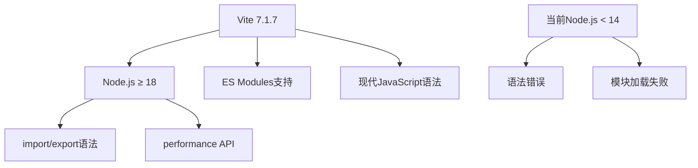
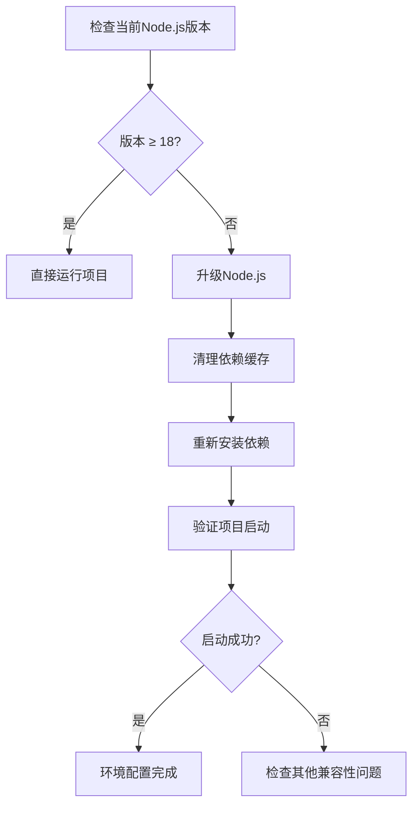
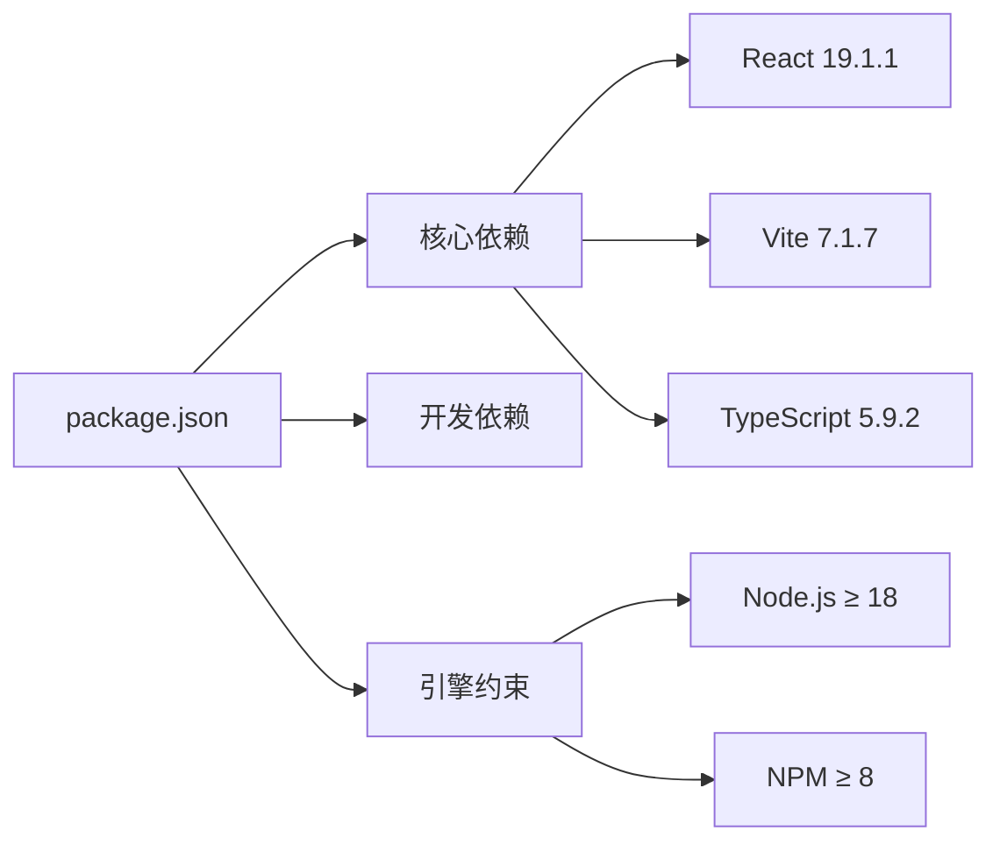
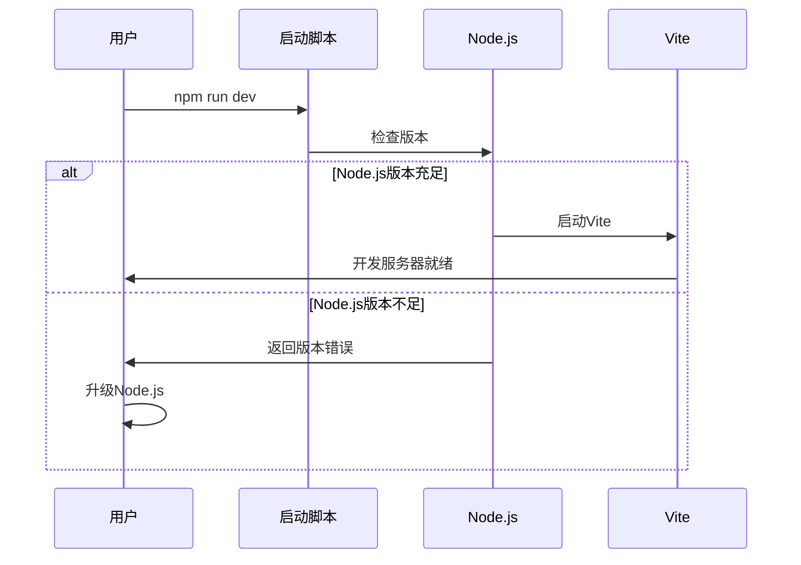
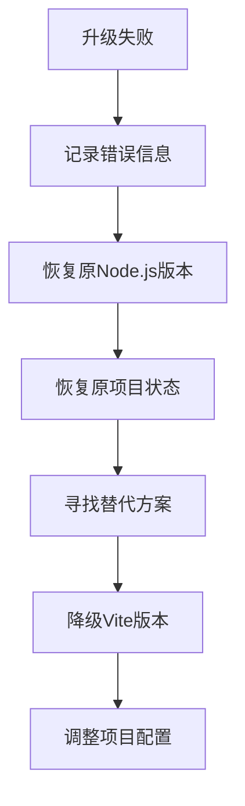

# 飞机大战项目运行错误分析与解决方案设计

## 概述

本文档分析了飞机大战项目在启动过程中遇到的Node.js版本兼容性错误，并提供了系统性的解决方案设计。项目基于React + TypeScript + Vite技术栈，在运行`npm run dev`时出现SyntaxError: Unexpected token {错误。

## 错误分析

### 核心问题

项目使用Vite 7.1.7版本作为构建工具，但当前Node.js环境版本过低，不支持Vite使用的ES模块语法，导致以下错误：

```
SyntaxError: Unexpected token {
    at Module._compile (internal/modules/cjs/loader.js:723:23)
```

### 错误根因分析

| 组件 | 当前版本 | 要求版本 | 兼容性问题 |
|------|----------|----------|------------|
| Vite | 7.1.7 | 需要Node.js ≥ 18 | ES模块语法支持 |
| Node.js | 推测 < 14 | ≥ 18.0.0 | import语法解析失败 |
| NPM | 对应版本 | ≥ 8.0.0 | 包管理兼容性 |

### 技术栈依赖关系



## 解决方案架构

### 环境升级策略

#### 主要解决路径

1. **Node.js环境升级**
   - 目标版本：Node.js 18.x LTS或更高版本
   - 升级方式：官方安装程序或版本管理工具
   - 验证要求：确保版本兼容性

2. **依赖重新安装**
   - 清理现有node_modules
   - 重新安装所有依赖包
   - 验证依赖兼容性

#### 版本管理解决方案

| 工具 | 适用场景 | 优势 | 注意事项 |
|------|----------|------|----------|
| 官方安装程序 | 单一项目环境 | 简单直接 | 可能影响其他项目 |
| nvm (Windows: nvm-windows) | 多项目环境 | 版本切换灵活 | 需要重新配置环境 |
| fnm | 跨平台需求 | 快速启动 | 相对新的工具 |

### 兼容性验证流程



## 项目配置优化

### Vite配置增强

针对不同环境的兼容性配置：

| 配置项 | 目的 | 实现方式 |
|--------|------|----------|
| 目标浏览器 | 确保构建产物兼容性 | browserslist配置 |
| 构建目标 | ES模块兼容性 | build.target设置 |
| 开发服务器 | 本地开发优化 | server配置调整 |

### 依赖管理策略



## 错误预防机制

### 环境检查自动化

1. **package.json引擎约束**
   - 添加engines字段
   - 指定Node.js最低版本要求
   - 配置NPM版本要求

2. **预启动检查脚本**
   - 版本兼容性验证
   - 环境要求检查
   - 依赖完整性验证

### 开发环境标准化

| 检查项 | 验证方法 | 失败处理 |
|--------|----------|----------|
| Node.js版本 | process.version检查 | 提示升级指引 |
| NPM版本 | npm --version验证 | 建议更新NPM |
| 依赖完整性 | package-lock.json校验 | 重新安装依赖 |

## 测试验证策略

### 环境验证测试



### 功能验证流程

1. **基础启动验证**
   - 开发服务器正常启动
   - 端口3000可访问
   - 热重载功能正常

2. **构建验证**
   - TypeScript编译成功
   - Vite构建无错误
   - 产物可正常部署

3. **依赖验证**
   - React组件正常渲染
   - Zustand状态管理正常
   - Ant Design组件库可用

## 实施计划

### 紧急修复阶段（立即执行）

1. **环境诊断**
   - 检查当前Node.js版本
   - 确认NPM版本
   - 评估升级影响

2. **版本升级**
   - 安装Node.js 18.x LTS
   - 更新NPM到最新版本
   - 验证环境变量配置

3. **项目重建**
   - 删除node_modules目录
   - 删除package-lock.json文件
   - 重新执行npm install

### 长期优化阶段

1. **配置增强**
   - 添加引擎版本约束
   - 配置开发环境检查
   - 建立环境标准文档

2. **团队协调**
   - 统一开发环境标准
   - 建立环境配置指南
   - 设置持续集成检查

## 风险评估与应对

### 潜在风险识别

| 风险类型 | 影响程度 | 发生概率 | 应对策略 |
|----------|----------|----------|----------|
| 其他项目兼容性 | 中等 | 中等 | 使用版本管理工具 |
| 依赖包版本冲突 | 低 | 低 | 清理缓存重装 |
| 系统环境变更 | 低 | 低 | 备份现有配置 |

### 回滚方案

